# Model editors 
Model editors allow users to define or modify existing ApiNATOMY models using a selected set of predefined GUI-based 
operations. Among other ways to define models are JSON code and Excel-style spreadsheets.  

**Important**: To save model changes performed via model editors described below, press `Apply changes` button in the 
right-side toolbar of the corresponding editor. If there were changes made, the button is marked with 
a red star (*). After that the updated input model will be processed by the model generator and appear in the model 
graph viewer (first tab called "Viewer"). Time delay is possible 
at this stage, this is a potentially computationally expensive process if a model requires generating numerous resources 
from templates, so we advise to use it after the (significant amount of) editing is done.

## Material editor 

The "Material editor" tab provides a GUI for defining materials and material-to-material and material-to-lyph relationships 
in ApiNATOMY input models. The editor consists of a main view that displays a directed acyclic graph (DAG) 
of material composition, and a property editing panel that allows users to edit properties of a selected material.
The view shows the material composition relationship as defined by the `materials`/`materialIn` properties
of materials (and lyphs which can be viewed as complex materials) in the input model.
To select a material, click on a graph node, it will be highlighted with a grey border around the material node.
The node's incoming and outgoing edges in the DAG will also be highlighted as thick grey lines. Properties
of the selected material can be viewed and revised via the property editing panel on the right. The right bottom panel
shows lyph definitions in which the selected material is used as layer.

On a double click the view is changed to a tree view with the selected material as its root. This view shows 
the composition hierarchy of the root material, i.e., which materials it is used in 
(nodes connected with pink links and arrows directed towards the selected material) and which materials it includes 
(nodes connected with black links and arrows directed away from the selected material).   

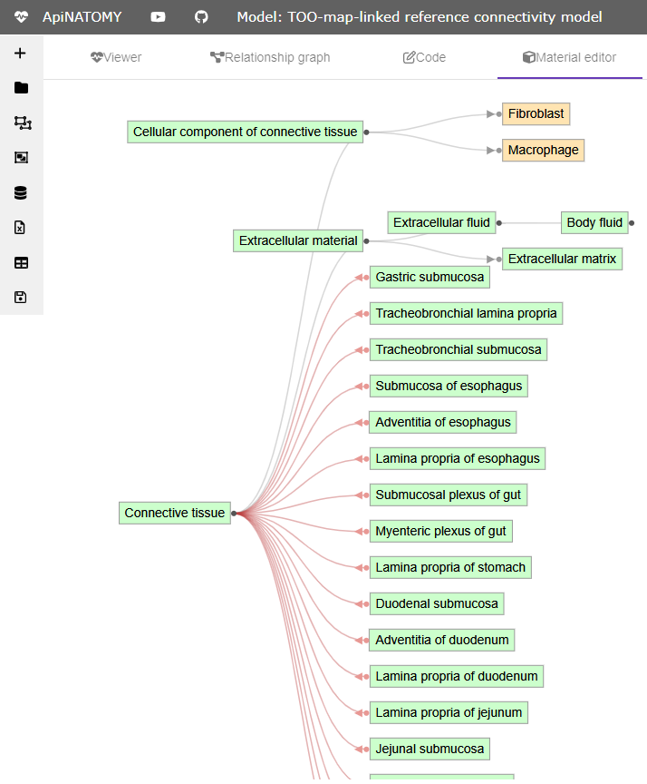

### Operations
CRUD (Create, Read, Update, and Delete) operations can be performed on selected materials using mouse right-click 
menus. These operations are context-dependent - they are applied to a selected material. 
Each applied operation is registered and can be reverted or repeated using `Undo` and `Redo` buttons on the right-side 
vertical toolbar.

#### Material properties
All resources in ApiNATOMY data model, including Material, are derived from an abtract class Resource ## [connectivity model](./model.md# Connectivity model)
and inherit from it basic properties `id`, `name`, and `ontologyTerms`. 
Editing of these properties is performed in the same way for all types of resources.

A correct resource definition should include properties `id` and `name` that are used to identify the purpose of the resource and
include it into the model graph by reference from other resources. One can edit these properties via the editing panel
present in Material editor as well as other resource editors (Lyph editor, Chain editor, and Coalescence editor). 

When identifier is changed, all references to the selected resource are replaced to the new identifier. Identifies should comply to the ApiNATOMY schema, 
i.e., should not contain spaces or start from a digit. A resource name usually reflects its physiological meaning. However, names can be ambiguous, so to properly specify a physiological
part represented by a resource, modellers should annotate it with appropriate ontology terms. 
Several terms can be assigned to each resource, one can add and remove ontology annotations using a plus icon and icons with 
trash bin next to the terms in a list. 
Once an annotation is added, it has a generated temporary identifier that needs to be replaced with a proper term reference.
Such a reference typically consists of an ontology prefix followed by a semicolon separator, and a term identifier in the 
chosen ontology, e.g., `UBERON:0001898` for hypothalamus in the [Uber-anatomy ontology](https://www.ebi.ac.uk/ols4/ontologies/uberon),
or `FMA:5875` for the white communicating ramus in the [Foundational Model of Anatomy](https://www.ebi.ac.uk/ols4/ontologies/fma/classes/http%253A%252F%252Fpurl.obolibrary.org%252Fobo%252FFMA_5875) ontology.

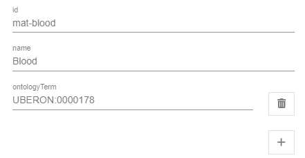

#### Create new material

To create a new material, click right button on an empty space and select `Add material`. A new loose node with temporary
identifier and name will be added to the graph, one can rename and annotate it via the property editing panel. 
The screenshot below shows the menu to add a new material. 

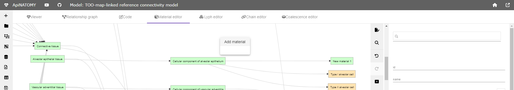

#### Create a new relationship

To include a material into another material, select a parent node, find a child material in the search box and press 
add button below. The relationship link will be created and appear in the graph.
It is important to note that lyph templates can be seen as composite materials and may be used as constituent parts of other
materials too. Existing lyph templates can be added to the graph and linked with existing nodes in the same way as materials,
via the search panel. To define new lyph templates, use the Lyph editor.

The screenshot below shows a material node "Cellular component of alveolar epithelium" linked to a newly created material 
"New material 1" which was added via the search panel in the right. 
Apart from this material, the selected node contains also 2 lyph templates as its 
sub-materials.  

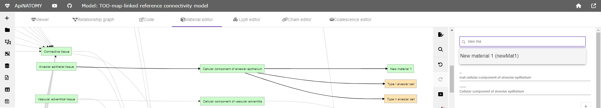

#### Delete relationship

To delete a specific relationship, right click on the corresponding edge and press "Delete relation".

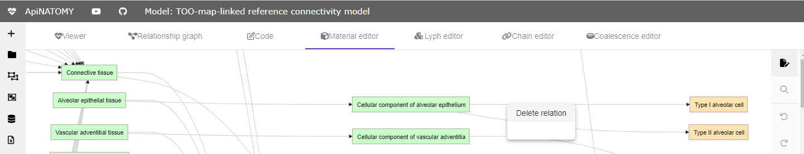

#### Delete material, disconnect parents or children

Right click on a material node shows context menu which allows modellers to remove the node from the model, 
disconnect it from its parents or children.

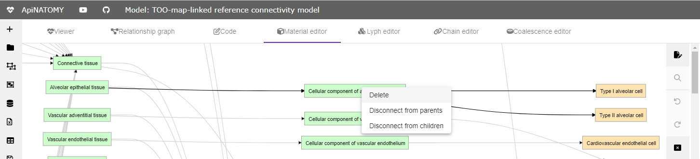

#### Define as material or Define as lyph

If a material includes undefined resource, it is shown in the graph with grey node. To correct the model, a user should 
add an explicit definition for the referred resource by either creating a material or lyph template with the given 
identifier. The corresponding node will be updated and the color will change to green (material) or orange (lyph template).

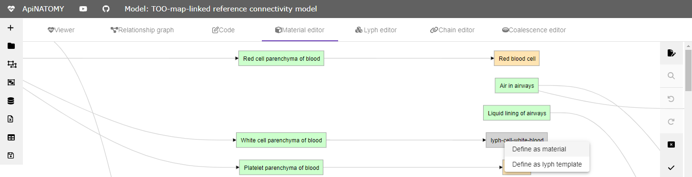

## Lyph editor

The "Lyph editor" tab provides a GUI for defining lyphs and lyph-to-lyph relationships in 
ApiNATOMY input models. The editor consists of 3 hierarchical trees, and a property editing panel.

The first tree view shows the list of declared lyphs arranged into hierarchy by the 
`sypertype`/`subtypes` relationships. By clicking on the lyph identifier in this component, one selects 
a lyph to inspect and modify. The second view shows the layers of the selected lyph defined by 
`layers`/`layerIn` relationships. The third view shows internal lyphs of the selected lyph 
defined by `internalLyphs`/`internalIn` relationships. 

Users can identify lyphs that have layers and/or internal lyphs by presence of special icons next to the lyph name in the lyph view.
For example, a selected lyph in the image below has both layers and internal lyphs.  

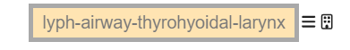

### Operations
CRUD (Create, Read, Update, and Delete) operations can be performed on selected lyphs using mouse right-click 
menus. These operations are context-dependent - they are applied to a selected lyph in an active tree and vary depending
what tree is active. An active tree is highlighted by a grey border around the tree name. Each applied operation is registered and can be 
reverted or repeated using `Undo` and `Redo` buttons on the right-side toolbar.
Some operations, namely, creation of new lyphs
and transition from one editing state to another (undo/redo) are performed via a vertical toolbar in the right 
part of the viewer. 

#### Lyph properties
Lyph definition panel extends the general resource definition panel with controls to define lyph's topology, indicate whether 
a lyph is a reusable template or a specific instance, and assign lyphs to hosting regions.

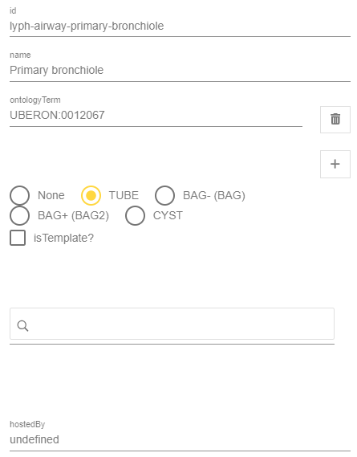

#### Delete definition
Unlike `delete` operations described below which are context dependent, `Delete definition` can be performed from any 
tree and only removes the chosen lyph declaration. This may produce a model with undefined references which will trigger a warning in the ApiNATOMY model (the tool will generate 
an artificial lyph to proceed with the visualization).  

#### Define as material or Define as lyph
It may happen that a lyph refers to a resource in its `subtypes`, `layers` or `internalLyphs` arrays, but the referred
resource is not declared in the model. To be able to display such a reference graphically in the trees, we generate a  
tree node that represents the reference but does not correspond to an actual resource declaration in the model, such node
can be recognized by its grey color. Two options will be given in the context menu for such nodes: `Define as lyph` and 
`Define as material`, which generate a new lyph or material declaration with the given `id`, respectively. After that the color
of the corresponding tree node should change to the light orange for a lyph or light green for a material. 

### Lyphs and templates
Lyph templates are just lyphs with property `isTemplate` set to true and they are part of the lyph tree. 
All operations applicable to lyphs also apply to lyph templates and they are defined just as normal lyphs. 
However, a lyph template defines an abstract entity that can be referred multiple times from various other structures 
in a model, each such reference is substituted by a generated lyph instance
with a unique id by the ApiNATOMY model generator. 
More importantly for model editing, lyph templates are often reused in definitions of other lyphs via properties
`supertype` or `subtypes`. Lyph templates are shown in yellow as opposed to light orange for normal lyphs. 

#### Create new lyph
To create a new lyph, press top button `New lyph` on the right-side toolbar. A new lyph with identifier
`_newLyph#` and name `New lyph #` where `#` is a numerical order of the created lyph is added to the `lyphs` array 
of the current ApiNATOMY model. A corresponding node is created and added to the top of the lyph tree.  

#### Delete lyph 
To delete a lyph from the model, select a lyph in the main tree and click `Delete` in the context menu. 

This operation not only removes the definition, but also clears all the references to the deleted lyph. For example,
the image below shows 2 code changes induced by the deletion of the lyph `lt-PNS-ganglion`: not only its 
declaration is removed, but also the `supertype` reference of the lyph `lt-ganglion-visceral-mural` 
is cleared. Instead, if one wants to just detach subtype from the supertype, operation [Remove parent](#remove-supertype) 
should be applied

Note that the same menu button in `Layers` and `Internal lyphs` trees will not delete the chosen lyph definition,
it only detaches the lyph from the `layers` and `internalLyphs` arrays of the selected lyph (root of these trees), respectively.

#### Add subtype
To add a subtype to a selected lyph that inherits the lyph's properties and layers, right-click and select `Add` in the 
context menu. By default, a new lyph is created (as described in the operation [Create new lyph](#create-new-lyph)) 
and included to the subtypes of the selected lyph. However, if one wants to include an existing lyph, 
choose this lyph in the search box on the top of the Settings panel. The image below illustrates 
this case: first, we select `lyph-superior-cervical-ganglion` in the search box, then click `Add` on the lyph `lt-white-ramus` 
in the lyph tree, defining the `supertype/subtypes` relationship between them:     

Note that if a material is selected in the search box, a warning *"Cannot add a non-lyph resource as subtype"* will be issued.

#### Remove subtypes
To clear all subtypes from a lyph, select `Remove children` in the main tree. This operation removes references from the
lyph's property `subtypes`, the corresponding lyphs will appear at the top level of the main tree. The menu option is not 
available for lyphs with no subtypes.

#### Remove supertype
Lyphs with a supertype are located in a tree brunch under their supertype. To remove the supertype from a lyph, 
press a right mouse button on it and select `Remove parent`. The lyph will disappear from the subtree and appear 
at the top level of the main list. The menu option is not available for lyphs without a supertype.

### Layers 
One can identify lyphs with layers in the lyph tree by the icon with three bars. This icon may disapper if you delete all
layers or reappear if you add a layer toa  lyph that previously had no layers. The number of layers in a lyph also affects
the upper bar limit in the related internal tree's fields `internalLyphsInLayers`.   

#### Add layer
To add a layer to a lyph specification, select the lyph in the `Layers` tree and press `Add` in the right mouse button
context menu. The operation works similarly to the [Add subtype](#add-subtype) operation: if a lyph is selected via the search box,
it is included to the `layers` array, otherwise a new lyph is created and included to the layers. Note that one may add 
materials as layers. It is also allowed to add the same material or lyph template several times to define more than one layer 
composed of a certain tissue. However, if a user tries to include a lyph from the `supertype/subtype` hierarchy as a layer,
the editor will display an error message *"Cannot add a layer to this lyph: hierarchy or dependency conflict!"*.

If a selected lyph has a supertype with layers, i.e., it will inherit layers from its supertype, we show these layers 
in the Layer tree with a locker icon. It is not possible to add a layer to such a lyph, the same error as above will be triggered.

#### Delete layer (or remove layerIn)
To delete a layer from a selected lyph, right-click on the layer you want to delete and select `Delete` or `Remove parent`.
Both operations are equivalent: the first is seen from the point of view of editing the layer tree root while the second 
removes the parent `layerIn` property from the layer itself.

If a selected lyph has a supertype with layers, i.e., it will inherit layers from its supertype, we show these layers 
in the Layer tree with a locker icon. Such layers cannot be deleted or rearranged, to modify them one must edit the layers
of the supertype.

#### Remove layers

To remove all layers of a selected lyph, right-click on the lyph with layers in the layer tree and press `Remove children`.

This operation will not be available for lyphs without layers.

#### Move layer up/down

The order of layers in a lyph is important. The first layer defines the innermost tissue of the corresponding physiological
structure while the last layer defines the outermost tissue. To change positions of layers, right-click on a layer and
choose `Move up` or `Move down`.

### Internal lyphs
Internal lyphs define internal constituent parts of a selected lyph. They can be positioned in the selected lyph or its 
layers. To place an internal lyph to a layer of the selected lyph, indicate the ordinal number of the layer next to the
internal lyph node.  

#### Re-assigning internal lyphs to layers
Very often lyphs in ApiNATOMY models are not explicitly defined but are generated from generic lyph templates.
Each generated lyph contains generated layers whose identifiers are unknown at the modelling stage.
If a modeller wants to specify internal structure of one or more of these layers, the only option is to refer to them by 
indicating their order within the main lyph. This can be achieved by supplying layer indices next to the items in
the internal lyph list, implying that the corresponding lyph belongs to the layer with the index given index, where 
0 refers to the innermost, closest to the axis, lyph. Thus, in the screenshot below, the internal lyph `lyph-laryngeal-mechanoreceptors`
belongs to the layer with index 1. This lyph will be derived from the abstract material 
`mat-temporary-laryngeal-wall`.  

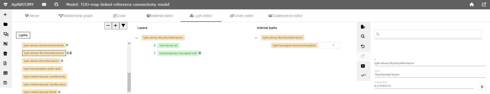

Model authors can specify and/or modify the layer index using the number input box next to an internal lyph. 
The maximal value in this list is bounded by the actual number of layers the host will have, whether they are inherited
from the template or defined explicitely.

#### Add internal
To add an internal lyph to a lyph specification, select the lyph in the `Internal lyphs` tree and press `Add` in the
right mouse button context menu. The operation works similarly to the [Add subtype](#add-subtype) operation: if a lyph 
is selected via the search box, it is included to the `internalLyphs` array, otherwise a new lyph is created and becomes 
internal in the selected lyph. Note that one may add materials as internal lyphs. It is not allowed to add the same 
material or lyph template several times. an error message *"Cannot add this internal lyph to the selected lyph!"* will 
be issued.

#### Delete internal lyph (or Remove internalIn)
To delete an internal lyph from a selected lyph, right-click on the lyph you want to delete and select `Delete` or `Remove parent`.
Both operations are equivalent: the first is seen from the point of view of editing the internal lyph tree root while the second 
removes the parent `internalIn` property from the lyph itself.

#### Remove internal lyphs

To remove all internal lyphs from a selected lyph, right-click on the root node in the internal lyph tree and press 
`Remove children`.

## Chain editor

The "Chain editor" tab provides a GUI for combining lyphs into chains - sequences of nodes and links conveying
lyphs which are included into a global model graph by joining graph nodes or via more complex relationships with its 
other elements (e.g., a chain can be wired to a scaffold wire or hosted by a scaffold region). 
The ApiNATOMY model schema has several templates for defining chains and various ways to specify their positioning.
However, the Chain editor currently supports only one template, most needed for the whole body knowledge graph (WBKG) 
chain definition: a chain is simply defined as an ordered list of lyph instances.

The editor consists of a main view that displays a list of existing (already defined in a model) chains. 
By clicking on the chain identifier in this list, a user selects 
a chain to inspect and modify, the second list is updated to show lyphs of the selected chains. 
Chain's properties are shown in the right-hand panel. By clicking on a lyph in the lyph view, modellers can inspect 
the structure of the selected lyph - its layers are listed under the property definition panel in the bottom right.

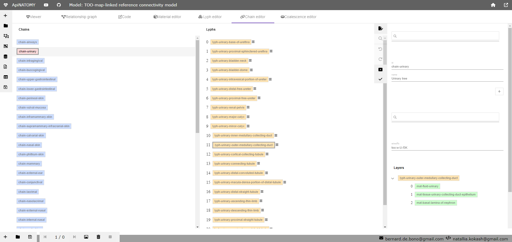

Chain editing operations are performed in the same way as the operations described in the chapter about the Lyph editor. 

## Coalescence editor

The "Coalescence editor" tab provides a GUI for defining sets of coalescing lyphs, i.e., lyphs with shared or connecting
tissue layers that llow penetration of fluids.

The editor consists of a main view that displays a list of existing (already present in a model) coalescence definitions. 
By clicking on the coalescence identifier in this list, a user selects 
a coalescence to inspect and modify. The second list  in the editor is updated to show lyphs in the selected coalescence. 
A correct coalescence definition includes at least 2 lyph instances.

The properties of the selected coalescence are shown in the right-hand panel. By clicking on a lyph in the lyph view, 
modellers can inspect the structure of the selected lyph - its layers are listed under the property definition 
panel in the bottom right.

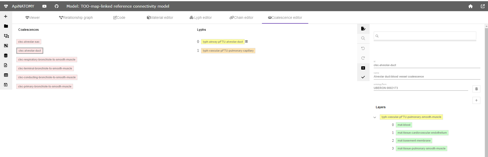

Coalescence editing operations are performed in the same way as the operations described in the chapter about the Lyph editor. 