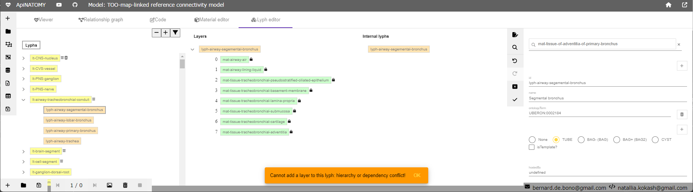

# Material Editor 

The "Material editor" tab provides a GUI for defining materials and material-to-material and material-to-lyph relationships 
in ApiNATOMY input models. The editor consists of a main view that displays a directed acyclic graph (DAG) 
of material composition, and a property editing panel that allows users to edit properties of a selected material.
To select a material, click on a graph node, it will be highlighted with a grey border around the material node.

# Lyph editor

The "Lyph editor" tab provides a GUI for defining lyphs and lyph-to-lyph relationships in 
ApiNATOMY input models. The editor consists of 3 hierarchical trees, and a property editing panel.

The first tree view shows the list of declared lyphs arranged into hierarchy by the 
`sypertype`/`subtypes` relationships. By clicking on the lyph identifier in this component, one selects 
a lyph to inspect and modify. The second view shows the layers of the selected lyph defined by 
`layers`/`layerIn` relationships. The third view shows internal lyphs of the selected lyph 
defined by `internalLyphs`/`internalIn` relationships. 

## Operations
CRUD (Create, Read, Update, and Delete) operations can be performed on selected lyphs using mouse right-click 
menus. These operations are context-dependent - they are applied to a selected lyph in an active tree and vary depending
what tree is active. An active tree is highlighted by a grey border around the tree name. Each applied operation is registered and can be 
reverted or repeated using `Undo` and `Redo` buttons on the right toolbar.
Some operations, namely, creation of new lyphs
and transition from one editing state to another (undo/redo) are performed via a vertical toolbar in the right 
part of the viewer. 

#### Delete definition
Unlike `delete` operations described below which are context dependent, `Delete definition` can be performed from any 
tree and only removes the chosen lyph 
declaration. This may produce a model with undefined references which will trigger a warning in the ApiNATOMY model (the tool will generate 
an artificial lyph to proceed with the visualization).  

#### Define as material or Define as lyph
It may happen that a lyph refers to a resource in its `subtypes`, `layers` or `internalLyphs` arrays, but the referred
resource is not declared in the model. To be able to display such a reference graphically in the trees, we generate a  
tree node that represents the reference but does not correspond to an actual resource declaration in the model, such node
can be recognized by its grey color. Two options will be given in the context menu for such nodes: `Define as lyph` and 
`Define as material`, which generate a new lyph or material declaration with the given `id`, respectively. After that the color
of the corresponding tree node should change to the light orange for a lyph or light green for a material. 

### Lyphs and templates
Lyph templates are just lyphs with property `isTemplate` set to true and they are part of the lyph tree. 
All operations applicable to lyphs also apply to lyph templates and they are defined just as normal lyphs. 
However, a lyph template defines an abstract entity that can be referred multiple times from various other structures 
in a model, each such reference is substituted by a generated lyph instance
with a unique id by the ApiNATOMY model generator. 
More importantly for model editing, lyph templates are often reused in definitions of other lyphs via properties
`supertype` or `subtypes`. Lyph templates are shown in yellow as opposed to light orange for normal lyphs. 

#### Create new lyph
To create a new lyph, press top button `New lyph` on the right toolbar. A new lyph with identifier
`_newLyph#` and name `New lyph #` where `#` is a numerical order of the created lyph is added to the `lyphs` array 
of the current ApiNATOMY model. A corresponding node is created and added to the top of the lyph tree.  

#### Delete lyph 
To delete a lyph from the model, select a lyph in the main tree and click `Delete` in the context menu. 

This operation not only removes the definition, but also clears all the references to the deleted lyph. For example,
the image below shows 2 code changes induced by the deletion of the lyph `lt-PNS-ganglion`: not only its 
declaration is removed, but also the `supertype` reference of the lyph `lt-ganglion-visceral-mural` 
is cleared. Instead, if one wants to just detach subtype from the supertype, operation [Remove parent](#remove-supertype) 
should be applied

Note that the same menu button in `Layers` and `Internal lyphs` trees will not delete the chosen lyph definition,
it only detaches the lyph from the `layers` and `internalLyphs` arrays of the selected lyph (root of these trees), respectively.

#### Add subtype
To add a subtype to a selected lyph that inherits the lyph's properties and layers, right-click and select `Add` in the 
context menu. By default, a new lyph is created (as described in the operation [Create new lyph](#create-new-lyph)) 
and included to the subtypes of the selected lyph. However, if one wants to include an existing lyph, 
choose this lyph in the search box on the top of the Settings panel. The image below illustrates 
this case: first, we select `lyph-superior-cervical-ganglion` in the search box, then click `Add` on the lyph `lt-white-ramus` 
in the lyph tree, defining the `supertype/subtypes` relationship between them:     

Note that if a material is selected in the search box, a warning *"Cannot add a non-lyph resource as subtype"* will be issued.

#### Remove subtypes
To clear all subtypes from a lyph, select `Remove children` in the main tree. This operation removes references from the
lyph's property `subtypes`, the corresponding lyphs will appear at the top level of the main tree. The menu option is not 
available for lyphs with no subtypes.

#### Remove supertype
Lyphs with a supertype are located in a tree brunch under their supertype. To remove the supertype from a lyph, 
press a right mouse button on it and select `Remove parent`. The lyph will disappear from the subtree and appear 
at the top level of the main list. The menu option is not available for lyphs without a supertype.

### Layers 
One can identify lyphs with layers in the lyph tree by the icon with three bars. This icon may disapper if you delete all
layers or reappear if you add a layer toa  lyph that previously had no layers. The number of layers in a lyph also affects
the upper bar limit in the related internal tree's fields `internalLyphsInLayers`.   

#### Add layer
To add a layer to a lyph specification, select the lyph in the `Layers` tree and press `Add` in the right mouse button
context menu. The operation works similarly to the [Add subtype](#add-subtype) operation: if a lyph is selected via the search box,
it is included to the `layers` array, otherwise a new lyph is created and included to the layers. Note that one may add 
materials as layers. It is also allowed to add the same material or lyph template several times to define more than one layer 
composed of a certain tissue. However, if a user tries to include a lyph from the `supertype/subtype` hierarchy as a layer,
the editor will display an error message *"Cannot add a layer to this lyph: hierarchy or dependency conflict!"*.

If a selected lyph has a supertype with layers, i.e., it will inherit layers from its supertype, we show these layers 
in the Layer tree with a locker icon. It is not possible to add a layer to such a lyph, the same error as above will be triggered.

#### Delete layer (or remove layerIn)
To delete a layer from a selected lyph, right-click on the layer you want to delete and select `Delete` or `Remove parent`.
Both operations are equivalent: the first is seen from the point of view of editing the layer tree root while the second 
removes the parent `layerIn` property from the layer itself.

If a selected lyph has a supertype with layers, i.e., it will inherit layers from its supertype, we show these layers 
in the Layer tree with a locker icon. Such layers cannot be deleted or rearranged, to modify them one must edit the layers
of the supertype.

#### Remove layers

To remove all layers of a selected lyph, right-click on the lyph with layers in the layer tree and press `Remove children`.

This operation will not be available for lyphs without layers.

#### Move layer up/down

The order of layers in a lyph is important. The first layer defines the innermost tissue of the corresponding physiological
structure while the last layer defines the outermost tissue. To change positions of layers, right-click on a layer and
choose `Move up` or `Move down`.

### Internal lyphs
Internal lyphs define internal constituent parts of a selected lyph. They can be positioned in the selected lyph or its 
layers. To place an internal lyph to a layer of the selected lyph, indicate the ordinal number of the layer next to the
internal lyph node.  

#### Add internal
To add an internal lyph to a lyph specification, select the lyph in the `Internal lyphs` tree and press `Add` in the
right mouse button context menu. The operation works similarly to the [Add subtype](#add-subtype) operation: if a lyph 
is selected via the search box, it is included to the `internalLyphs` array, otherwise a new lyph is created and becomes 
internal in the selected lyph. Note that one may add materials as internal lyphs. It is not allowed to add the same 
material or lyph template several times. an error message *"Cannot add this internal lyph to the selected lyph!"* will 
be issued.

#### Delete internal lyph (or Remove internalIn)

#### Remove internal lyphs

