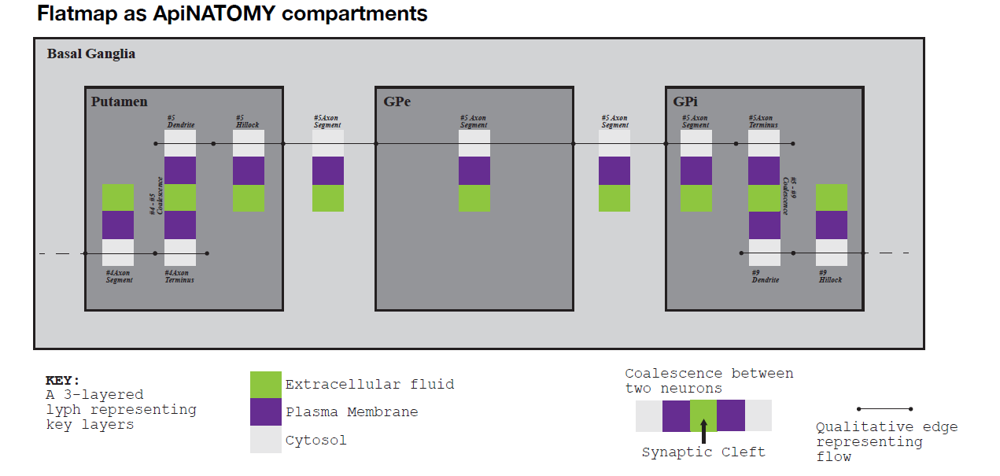
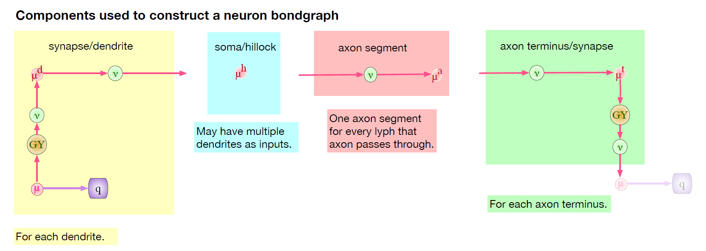
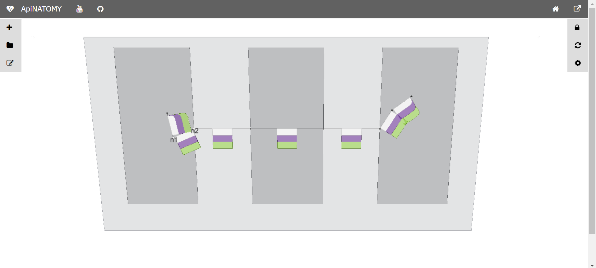
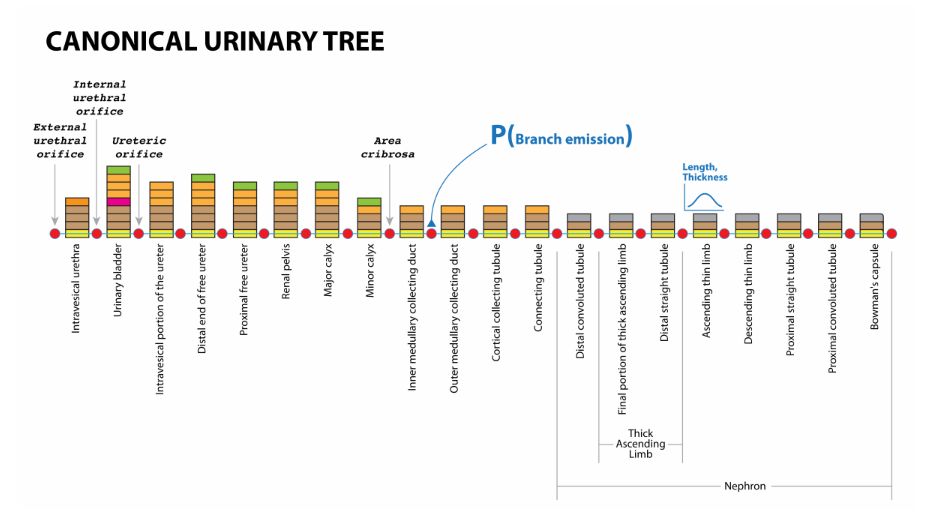

# Examples

## Basal Ganglia

The _basal ganglia_ are a group of subcortical nuclei at the base of the forebrain and top of the midbrain. The basal ganglia are associated with a variety of functions, including control of voluntary motor movements, procedural learning, habit learning, eye movements, cognition, and emotion. Basal ganglia are strongly interconnected with the cerebral cortex, thalamus, and brainstem, as well as several other brain areas.



The ApiNATOMY [model](https://github.com/open-physiology/open-physiology-viewer/blob/master/test/data/neuronTreesAuto.json) automatically reproduces the layout from the schematic representation of the basal ganglia created by the physiology experts, given relational constraints among its constituent parts.
Conceptually, the model consists of:

* 4 context lyphs: Basal Ganglia, Putamen, Globus Pallidus external (GPe) and Globus Pallidus internal (GPi) segments;
* a model of a neuron composed of 3 parts: `dendrite` and `axon` modelled as trees
(we call them `omega trees`) and a conduit representing the axon `hillock` (a specialized part of the cell body, or soma, of a neuron that connects to the axon) that joins the omega trees on its sides.



Even though omega threes often look like simple chains in our schematics, the underlying data model
implies that a branching tree can be generated from the canonical representation given model parameters such as branching factor or  mean number of branches at each level).

Technically, the model is essentially a JSON file with 4 fields: `nodes`, `links`, `lyphs`, and `trees`. The context lyphs, Putamen, GPe and GPi, are modelled as internal lyphs of Basal Ganglia:
```json
   {
      "id"    : "bg",
      "name"  : "Basal Ganglia",
      "color" : "#d1d2d4",
      "internalLyphColumns": 3,
      "internalLyphs": [ "putamen", "gpe", "gpi" ]
   }
```
This means that they are positioned on a grid within their container lyph, and the corresponding parameter, `internalLyphColumns: 3` indicates that the grid should contain 3 columns. The number
of rows depends on the number of internal lyphs within the container.
Other space allocation methods for internal lyphs will be supported upon demand, for example,
[template-based treemaps](http://www.nkokash.com/documents/IVAPP2014-treemaps.pdf) appear to be particularly useful if we need to dedicate areas of various size to internal lyphs while preserving relevant adjacency constraints.

The nodes and links to model rotational axes of internal lyphs are auto generated (they can also be defined explicitly if a user wants to override the default properties, i.e., make them visible, or specify relationships between them and other graph entities). Thus, in our model, we only define the position and the size of the main context lyph's axis, Basal Ganglia:

```json
    "nodes": [
        { "id": "a", "layout": {"x": -100, "y": 100, "z": 0 } },
        { "id": "b", "layout": { "x": 100, "y": 100, "z": 0 } },...
    ],
    "links": [
        {
            "id"      : "main",
            "source"  : "a",
            "target"  : "b",
            "length"  : 100,
            "geometry": "invisible",
            "conveyingLyph": "bg"
        },...
    ]
```

The `trees` property is an array with 2 objects defining the `dendrite` 1-level tree and the `axonal` 5-level trees:
```json
    "trees": [
        {
          "id"          : "dendrite",
          "name"        : "Dendrite omega tree",
          "root"        : "n1",
          "numLevels"   : 1,
          "lyphTemplate": "neuronBag"
        },
        {
          "id"          : "axonal",
          "name"        : "Axonal omega tree",
          "root"        : "n2",
          "numLevels"   : 5,
          "lyphTemplate": "neuronBag"
        }
    ],
```

The tree root nodes are named `n1` and `n2`, these names are explicitly given while defining the the axis of the axon hillock, and by referring to them in the tree model, we indicate that the roots of the `axonal` and `dendrite` trees coincide with the ends of the `hillock`.

Similarly to the root nodes, it is possible to plug an external link, a node or a lyph into the generated tree at a certain level via the optional `levels` property which expects an array with (partial) link definitions (see [JSON Schema](../schema/index.html#/definitions/Tree) definition of the tree model for more details).

In the current model, we do not refer to external entities while defining the content of the tree branches. However, all auto-generated ApiNATOMY entities are also assigned IDs that can be referenced later to connect the part of the graph obtained from the tree template with the rest of the model. The identifies for auto-generated tree parts are formed using the following patterns:

* `{$tree.id}_node{$index}`
* `{$tree.id}_lnk{$index}`
* `{$tree.id}_lyph{$index}`

where `$tree.id` is the identifier of the tree, and `$index` refers to a tree level.
For the node names, the `$index` ranges from 0 to N, where N is the number of levels. Hence,
the root node corresponds to the index = 0, the end node of the tree branch at the first level - to the index = 1, and so on. For the link and lyph names, the index ranges from 1 to N. For example, the valid ID names for the basal ganglia trees:

* `axonal_node3`  - end node of the 3d level of the 'axonal' tree
* `axonal_lyph5`  - lyph at the 5th level of the 'axonal' tree,
* `dendrite_lnk1` - link at the 1st level of the 'dendrite' tree.

These names can be used to impose positional constraints on the generated entities. For example,
in our model, the axonal tree node is located on the 2nd radial border of the GPi lyph, while two axonal tree
level lyphs are hosted by (mapped to the surface of) the the GPi lyph.
```json
    {
        "id"          : "gpi",
        "name"        : "GPi",
        "color"       : "#939598",
        "height"      : 30,
        "border"      : { "borders": [ {}, {}, {}, { "hostedNodes": [ "axonal_node3" ] }]},
        "hostedLyphs" : [ "axonal_lyph4", "axonal_lyph5" ]
    }
```

Another [version](https://github.com/open-physiology/open-physiology-viewer/blob/master/test/data/neuronTrees.json) of the basal ganglia shows how one can combine explicitly assigned tree levels with auto-generated ones.

The `lyphTemplate` field in these omega tree models refers to the lyph pattern to derive the structure of the conduits in the tree branches. Firstly, the tool expands the tree template by creating the necessary graph structure (a rooted tree with the required number of levels). Secondly, the blank lyph definitions associated with the tree graph are added to the `subtypes` property of the lyph template. At the next stage, the lyph viewer will process the lyph templates: the prototype lyph layers, color and size settings are copied to all template subtypes.
Hence, at the tree expansion stage, the user definition of the template lyph:
```json
    "lyphs": [
        {
            "id"        : "neuronBag",
            "isTemplate": true,
            "topology"  : "BAG",
            "color"     : "#ccc",
            "scale": {
                "width" : 80,
                "height": 80
            },
            "layers": ["cytosol", "plasma", "fluid"]
        },...
    ]
```
is extended with the definition of subtype lyphs which will get 3 layers and will occupy each the square area with a side length computed as 80% of their axis length. Note that the `hillock` lyph also derives its structure from the `neuronBag` template, as indicated by its property `supertype`:
```json
   {
        "id"       : "hillock",
        "name"     : "Hillock",
        "supertype": "neuronBag",
        "topology" : "TUBE"
   },
```
Hence, after the generation of entities to represent required tree structures and bi-directional relationship synchronization, the user definition of the neuron template in the model will be auto-completed, i.e., the lyph template will know all lyphs that replicated its layers via its `subtypes` property:
```json
    "subtypes": [axonal_lyph1,...,axonal_lyph5, dendrite_lyph1, hillock]
```

Generally, each lyph originating from a lyph template, inherits its topology.
However, in an omega tree model, the topology of the lyph template defines not the topology of individual level lyphs, but the overall topology of the tree. The lyphs conveyed by the tree edges can be seen as a single conduit with topological borders at the start and the end levels (root and leaves) of the tree compliant with the borders of the lyph template. Thus, the topology of the lyphs on tree edges is defined according to the table below:

| Lyph template | Radial borders | Tree |Level 1|Levels 2..N-1| Level N|
|:-------------:|:--------------:|:----:|:-----:|:-----------:|:------:|
| TUBE          | both open      | TUBE | TUBE  | TUBE        | TUBE   |
| BAG           | 1st closed     | BAG  | TUBE  | TUBE        | BAG    |
| BAG2          | 2nd closed     | BAG2 | BAG2  | TUBE        | TUBE   |
| CYST          | both closed    | CYST | BAG2  | TUBE        | BAG    |

In our example, the lyph template is of type `BAG`. Hence, only the conveying lyph at the end levels, `dendrite_lyph1` and `axonal_lyph5`, are of the type `BAG` while all the intermediate level lyphs, `axonal_lyph1,...,axonal_lyph4`, are of the type `TUBE`.

The topology of the `hillock` lyph, which also inherits the layer structure from the `neuronBag` lyph template, has to be explicitly defined as `TUBE` to override the inherited topology from the template.

The image below shows the layout created by the tool for the Basal Ganglia scenario based on the
resource definition explained in this section.


The live demo of this scenario with the possibility to edit the model file in an integrated JSON editor is available [here](http://open-physiology.org/demo/open-physiology-viewer/trees).

## Urinary Omega Tree

This model illustrates the ApiNATOMY format for the urinary arborisation.
The purpose of this example is to illustrate how one can model an omega tree with branching points and resource annotation with references to external ontologies.



The urinary tree [model](https://github.com/open-physiology/open-physiology-viewer/blob/master/test/data/urinaryOmegaTree.json) consists of 21 level.
Levels are defined as links conveying specific lyphs, from Intravesical Urethra to Visceral Bowman's Capsule.
The layer structure of these lyphs is modelled with the help of abstract templates that correspond to physiological tissues:
urine (URN), transitional epithelium (TE), basement membrane (BM), muscosa (Mus), muscularis (Ms1) etc.

```json
  {
      "id"        : "IU",
      "name"      : "Intravesical urethra",
      "topology"  : "TUBE",
      "length"    : {"min": 2, "max": 2},
      "thickness" : {"min": 3, "max": 3},
      "layers"    : ["URN", "Mcs", "Ms1"],
      "external"  : ["UBERON:0000057"]
  },
  {
      "id"        : "URN",
      "name"      : "Urine",
      "color"     : "#f9ed32",
      "isTemplate": true,
      "external"  : ["UBERON:0001088"]
  },
  ...
```

Whenever the specific lyphs refer to abstract lyphs as their layers, meaning that the conduit we model consists of certain tissues, the lyph viewer automatically generates lyph instances and replaces the conduit layers with the references to the generated lyphs representing tissues within the conduits, i.e., `urine in the intravesical urethra`. The generated lyphs will refer to the template via their `supertype` field and later inherit a set of template properties, namely,
 `color`, `scale`, `height`, `width`, `length`, and `thickness`, as well as the references in the field `external` which contains annotations that relate the ApiNATOMY lyph to existing ontological terms.

```json
  "trees" : [
    {
      "id"          : "UOT",
      "name"        : "Urinary Omega Tree",
      "root"        : "uot-a",
      "numLevels"   : 21,
      "levels"      : ["uot-lnk1", "uot-lnk2", "uot-lnk3", "uot-lnk4", "uot-lnk5", "uot-lnk6", "uot-lnk7", "uot-lnk8", "uot-lnk9", "uot-lnk10",
         "uot-lnk11", "uot-lnk12","uot-lnk13", "uot-lnk14", "uot-lnk15", "uot-lnk16", "uot-lnk17","uot-lnk18","uot-lnk19", "uot-lnk20", "uot-lnk21"
      ],
      "branchingFactors": [1, 1, 2, 1, 1, 1, 3],
      "comment": "Branching factors for the rest of the tree removed to avoid state explosion ... 3, 20, 8, 9, 8, 9, 1, 1, 1, 1, 1, 1, 1, 1"
    }
  ]
```

