# [JSON Schema](../schema/index.html)
 The ApiNATOMY input data is a JSON model that matches the [ApiNATOMY JSON Schema](../schema/index.html). The schema provides a contract between the input data and the lyph viewer component. Follow the link above to see the bootprint of the schema.
 
# Connectivity model

Knowledge representation in ApiNATOMY has its basis in the constraints of forming tissue domain architecture. In particular, physiological system experts identify compartmental models of primary functional tissue units, so-called `pFTUs`. A `pFTU` is a cuff wrapped around a central (endothelial, epithelial or neural) canal, such that no two points within this domain are beyond average diffusion distance for small molecules. Two types of transfer processes occur over pFTUs: `advective` solid flow along the lumen of the vessel (mass fluid transport, e.g., urine along the ureter), and `diffusive` solute flow between the lumen of the vessel and the rest of the tissue cuff (e.g., calcium ions through a membrane channel). A pFTU therefore represents a point of transition between long and short range molecular interactions.

 Technically, an ApiNATOMY model is a JSON object that
  contains sets of entities which are either nodes, links, lyphs, materials, coalescences, channels, trees, or groups which contain subsets of these entities.
  Properties of these objects reflect the meaning and parameters of the associated physiological elements (connections, processes or tissue composition) as well as provide positioning constraints that help us to assemble them into structurally correct models of physiology.

  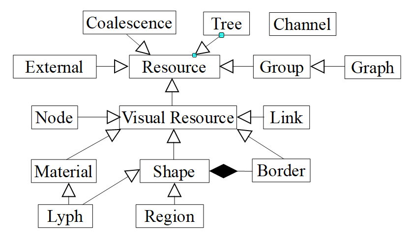
  
 In this manual, we explain, using small examples, how ApiNATOMY data model definitions render into graphical elements displayed by the ApiNATOMY lyph viewer.

## Resource
 All ApiNATOMY modelling elements have a common ancestor, an abstract resource that defines common properties present in all objects of the model.
  
 All entities come with basic properties such as `id`, `name` and `description` to define a modeling element. 
 An identifier must start with a letter and can include lower and uppercase letters, numbers, and special symbols such as 
`:_./@?\-='`, no spaces are allowed! Identifiers of all entities must be unique, the tool will issue a warning if this is not the case.
 
 Each object has a read-only property `class` (the user does not need to specify it, it is assigned automatically) that returns its 
 class from the ApiNATOMY data model, such as 
  * `Node`, `Link`, `Lyph`, `Border`, `Material`, `Chain`, `Tree`, `Channel`, `Villus`, `Coalescence`, `Group`, and `Graph` for connectivity models,
  * `Anchor`, `Wire`, `Region`, `Component`, and`Scaffold` for scaffold models,
  * `State` and `Snapshot` for snapshot models,
  * `External`, `Reference`, and `OntologyTerm` for third-party annotation resources that can be used in any type of model.

 The properties `external`, `references`, and `ontologyTerms` may be used to keep a reference to an external data source 
 that defines or describes the entity, 
 i.e., PubMed publication or the [Foundational Model of Anatomy (FMA)](http://si.washington.edu/projects/fma) ontology term.
  
 The property `infoFields` lists properties that are shown in the information panel of the viewer. These properties are typically set by default for all entities of certain type, but may also be overridden for individual objects. For example, the following value of the `infoFields` property of a lyph object
 ```json
"infoFields": [ "id", "name", "topology", "conveyedBy", "layers" ]
 ```
 will instruct the viewer to show the lyph's `id`, `name`, `topology`,
 the signature of the link conveying the lyph, and the lyph's layers.

 The models of physiology systems may contain thousands or even millions of entities. While the majority of the information will come from existing data sources (publicly maintained data sets, ontologies, clinical trials, experiments, etc.), and converted to the expected format with the help of some data manipulation scripts, many properties in our model are specific for the lyph viewer. The derived input model has to be augmented with properties that help the viewer to produce a meaningful and clean graph layout. It is likely that it will take at least several attempts for the modeller to figure out the proper constraints for the intuitive visualization of a certain model. For example, one may want to draw links that represent all blood vessels as straight thick red lines or show neural connections as curved thin blue paths.
 
 To simplify the parameter setting process, we provide means to assign valid properties to subsets of entities in the model. 
 Each object may contain a property `assign` with two fields: `path` which contains a [JSONPath](https://www.npmjs.com/package/jsonpath) expression, and `value` object, that contains a JSON object to merge with each and every item in the set defined by the query in the `path`. For example, the following code assigns `color` and `scale` properties to all lyphs in the `Neural system` group:   
```json
{
    "id"    : "group1",
    "name"  : "Neural system",
    "assign": {
        "path"    : "$.lyphs[*]",
        "value"  : {
            "color": "#aaa",
            "scale": { "width": 200, "height": 100 }
        }
    }
 }
```
  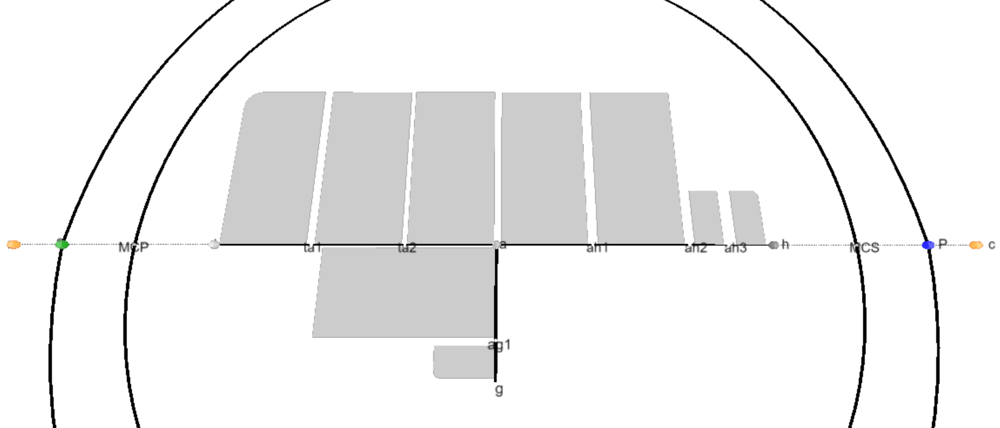

 In addition to the assignment of properties, either individually or as part of a dynamic group, we allow users to apply color interpolating schemes and gradual distance offsets. This is done with the help of the object's property `interpolate`.
 If the JSONPath query returns a one dimensional array, the schema is applied to its elements. If the query produces a higher-dimensional array, the schema is iteratively applied to all one-dimensional splices of the array.
 For example, the following fragment colors three layers of every lyph in the ``Neural system`` group of lyphs using the shades of blue, starting from the opposite side of the color array with 25% offset to avoid very light and very dark shades:
 
 ```json
"interpolate": {
  "path"   : "$.lyphs[*].layers",
  "color"  : {
     "scheme"  : "interpolateBlues",
     "offset"  : 0.25,
     "length"  : 3,
     "reversed": true
  }
}
 ```
   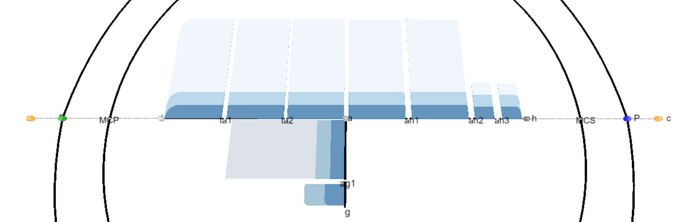

 For the details on supported color schemes, and specification format for interpolating colors and distance offsets, see the [ApiNATOMY JSON Schema](../schema/index.html) documentation.

### Visual resource
 `Visual resource` is a subclass of `Resource` that lists properties common for resources with visual artifacts, such as shape and its border (lyph or region), material, node, and link.

 The most basic visual artifact property is `color` - the color of the resource helps to interpret the model, identify resources that originate from the common template, etc. Additionally, each visual resource can have auxiliary boolean parameters `hidden`, `inactive`, and `skipLabels` that influence on its visibility, possibility to highlight the corresponding visual object and the visibility of its text label(s) in the lyph viewer, respectively.

## Node  
The ApiNATOMY model essentially defines a graph where the positions of nodes are computed by the force-directed layout. Nodes connect links which convey lyphs, the main modelling concept in the ApiNATOMY framework.

 Nodes are represented by spheres. The radius of the sphere is computed based on the value of the node's `val` property (the exact value depends also on the scaling factor, there is no well-defined physical characteristic associated with the numeric value of this property). 
 
 Properties `charge` and `collide` allow users to tune the forces applied to a specific node. 

 A modeller can control the positions of the nodes by assigning the desired location via the `layout` property. For example, the image below illustrates the graph for the 5 core nodes: 

```json
"nodes": [
    {
      "id"    : "a",
      "name"  : "a",
      "color" : "#808080",
      "val"   : 10,
      "fixed" : true,
      "layout": { "x" : 0, "y" : 0, "z" : 0 }
    },
    {
      "id"    : "c",
      "name"  : "c",
      "color" : "#D2691E",
      "val"   : 10,
      "layout": { "x" : 100, "y" : 0, "z" : 0 }
    },
    {
      "id"    : "n",
      "name"  : "n",
      "color" : "#D2691E",
      "val"   : 10,
      "layout": { "x" : -100, "y" : 0, "z" : 0 }
    },
    {
      "id"    : "L",
      "name"  : "L",
      "color" : "#ff0000",
      "val"   : 10,
      "layout": { "x" : 0, "y" : -75, "z" : 0 }
    },
    {
      "id"    : "R",
      "name"  : "R",
      "color" : "#7B68EE",
      "val"   : 10,
      "layout": { "x" : 0, "y" : 75, "z" : 0 }
    }
]
```
  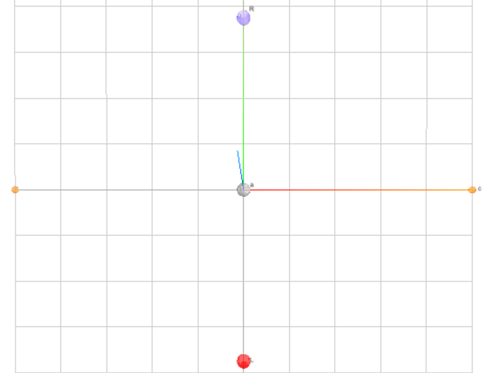

 In the above example, four nodes are positioned along `x` and `y` axes. The value of each coordinate is expected to be between -100 and 100, these numbers refer to the percentage of the lengths from the center of coordinates. The actual coordinates are then computed depending on the internal scaling factor. 

 The node `a` is placed to the center of coordinates. It is marked as `fixed`. Positions of fixed nodes are set to coincide with the desired positions in the `layout` property. For other types of nodes, the layout only defines the position the node is attracted to while its actual position `(x, y, z)` may be influenced by various factors, i.e., global forces in the graph, rigidity of the links, positions of other nodes, etc. Note that assigning (`x`, `y`, `z`) coordinates for the node in the model is ineffective as these properties are overridden by our graph layout algorithm and the initial settings will simply be ignored. The tool issues the corresponding warning if an unexpected property is present in the model. 

 It is important to retain in the model the containment and spacial adjacency relationships among entities. Several properties of a node object are used to constraint the positions of the node on a link, within a lyph or on its surface. It is also possible to define the desired position of a node in the graphical layout based on the positions of other nodes.
 
 To place a node on a link, we assign the link's ID to the node's property `hostedBy`.
 The related optional property `offset` can be used to indicate the offset in percentage from the start of the link. Thus, the definition below 
 ```json
{
    "id"       : "nLR00",
    "hostedBy" : "LR",
    "offset"   : 0.25
}
 ```
 instructs the viewer to position the node `nLR00` at the quarter of the length of the link `LR`. 
 
 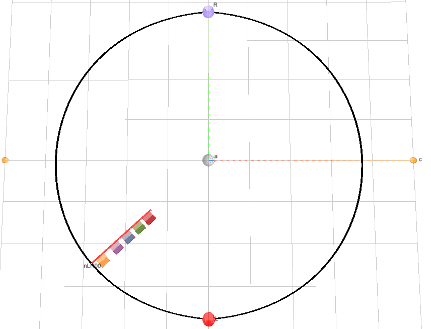
 
 An alternative way to get the same result, is to include the node's ID to the `hostedNodes` property of the link.

 To place a node on a lyph, assign the lyph's ID to the node's `internalIn` property. This will force the node to attract to the lyph's center. An alternative way to get the same result is to include the node's ID to the `internalNodes` property of the lyph.
 
 To place a node to the center of coordinates of a set of other nodes, list their ID's in the `controlNodes` array.
 
## Link 
 Links connect graph nodes and perform a number of functions in the ApiNATOMY framework, most notably, they model process flow and serve as rotational axes to position and scale conveying lyphs.

 By default, all links are drawn as straight lines, this corresponds to the `"geometry":"link"` setting. To apply another visualization method, we set the link's `geometry` to one of the supported values enumerated in the ApiNATOMY JSON Scheme. For example, `"geometry":"semicircle"` produces a spline that resembles a semicircle:
 
 ```json
 "links": [
     {
       "id"        : "RL",
       "name"      : "Pulmonary",
       "source"    : "R",
       "target"    : "L",
       "length"    : 75,
       "geometry"  : "semicircle",
       "stroke"    : "thick"
     },
     {
       "id"        : "LR",
       "name"      : "Systemic",
       "source"    : "L",
       "target"    : "R",
       "length"    : 75,
       "geometry"  : "semicircle",
       "stroke"    : "thick"
     },
     {
       "id"     : "cn",
       "source" : "c",
       "target" : "n",
       "length" : 100,
       "stroke" : "dashed"
     }
 ]
 ```
 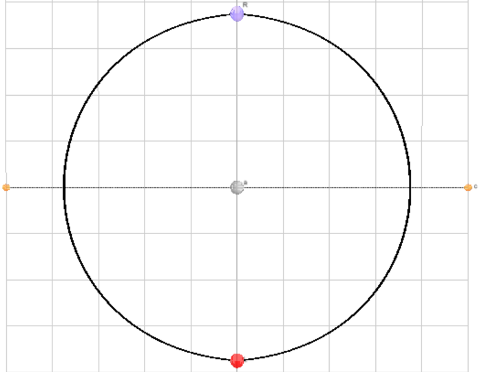
 
 Among other link geometries supported by the lyph viewer are
 * `spline` to draw link connectors that smoothly join preceding and following links
 * `rectangle` to draw splines that resemble a semi-square connector with rounded corners
 * `path` to draw graph edges bundled together by the [d3.js edge bundling method](https://bl.ocks.org/vasturiano/7c5f24ef7d4237f7eb33f17e59a6976e).
 
 There are also auxiliary links: `invisible` links are never displayed themselves but serve as axes for the lyphs they convey. The `invisible` links can either be defined explicitly in the model or auto-generated, e.g., when a lyph that is an `internalLyph` of some other lyph is not conveyed by any user-defined link in the model;

 The property `stroke` set to `dashed` yields a dashed line while its property `thick` set to `true` indicates that the link should be drawn as a thick line. This option was introduced to overcome a well-known WebGL [issue](https://mattdesl.svbtle.com/drawing-lines-is-hard) with drawing thick lines. It instructs the lyph viewer to use a custom vertex shader. The optional property `lineWidth` can be used to specify how thick such links should be (the default value is 0.003).
 
 The property `length` defines the desired distance between the link ends in terms of the percentage from the maximal allowed length (which is equal to the main axis length in the lyph viewer). The link force from the [d3-force-3d](https://github.com/vasturiano/d3-force-3d#links) module pushes the link's source and target nodes together or apart according to the desired distance. More details about these parameters can be found in the documentation of the module. 
 
 A link of any type can be set to be `collapsible`. A collapsible link exists only if its ends are `constrained` by the visible entities in the view, i.e., the link's source and target nodes must be inside of visible lyphs, on separate lyph borders or are hosted by other visible links. If this is not the case, the source and target nodes of the collapsible link are attracted to each other until they collide to look like a single node.
 
 Collapsible links are auto-generated for the models where one node is constrained by two or more different resources (i.e., lyph borders) meaning that it should be placed to several different locations. This functionality allows modellers to include the same semantic entity to various subsystems in the model, even if these subsystems are split by some space for readability. The auto-generated collapsible links are `dashed` to emphasize that the link is an auxiliary line that helps to locate duplicates of the same node.
 
 The screenshots below show the link chain representing the anterolateral apinothalamic tract in isolation and in combination with the neural system group. Observe that in the latter case the tract's nodes are bound to the neural system lyph borders with thin dashed transitions among pairs of replicated node instances. 
 
 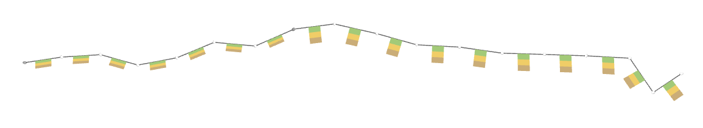
 
 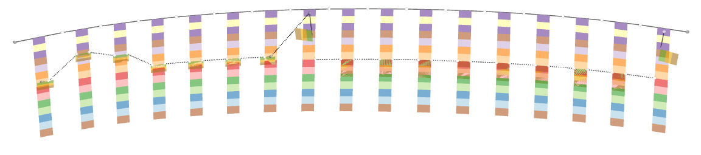
    
 Each link object must refer to its `source` and `target` nodes; these nodes will be able to access the link resource via the related `sourceOf` and `targetOf` properties.

 Although we do not draw arrows by default, all links in the ApiNATOMY graph are directed links. To show the arrows, set the link's flag `directed`. It is possible to change the direction of the link without overriding the `source` and `target` properties. If the boolean property `reversed` is set to `true`, its direction vector starts in the `target` node and ends in the `source` node, this is useful if we want to turn the lyph it conveys by 180 degrees in the 2d view.
 
 A link may have a conveying lyph which is set via its property `conveyingLyph`. The lyph conveyed by the link is placed to its center and uses the link as its rotational axis. The size of the lyph in the lyph viewer depends on the link's length, a more detailed of the size computation is given in the [Lyph](#lyph) section. Hence, one can define the same relationship from the other entity's perspective: by assigning the link's ID to the lyph's property `conveydBy`. 
 
 The property `hostedNodes` contains a set of nodes that are positioned on the link. This set should never include the link's source and target nodes.

 The field `fasciculatesIn` represents a specialized relationship that may point to a lyph that bundles the link (e.g., representing a neural connection).

## Shape
 A shape is an abstract concept that defines properties and relationships shared by ApINATOMY resources that model physiology entities, namely, lyphs and regions. An important part of the shape abstraction is its border.

 The property `internalNodes` may contain a set of nodes that have to be positioned on a shape. Such nodes will be projected to the shape's surface and attract to its center. Note that the viewer will not be able to render the graph if the positioning constraints are not satisfiable, i.e., if one tries to put the source or target node of the lyph's axis inside of the lyph, the force-directed layout method will not converge.

 The property `internalLyphs` is used to define the inner content of a shape, i.e., neurons within the neural system parts. The related property, `internalIn`, will indicate to which shape (lyph or region) the given lyph belongs.
 Internal lyphs should have an axis of rotation to be hold in place. In practice, there may be elements with uncertain or unspecified position within a larger element, i.e., blood cells within blood fluid. Until the method of positioning of inner content within a lyph is clarified by the physiology experts, we auto-generate links and position them on a grid within the container shape.
 
 Lyph templates can be internal in other lyph templates, including their layers. Such constructs would cause replication
 and instantiation of the internal lyph structure to each and every lyph instance derived from the lyph template that includes the internal lyph template.    
 For example, the listing below would produce 3 lyph instances, smooth muscle, chief stomach, and sensory neuron, derived     
 from a generic nucleated cell composed of a cytoplasm and wall layers. The cytoplasm layer of each lyph 
 has 4 internal lyphs representing nucleus, vesicle, mitochondria and endoplasmic reticulum. The mitochondria lyph template
 consists of 4 layers (l1,l2,l4,l4 - they must be explicitly defined in the model since they are also replicable templates, but we omit
 the definitions for the sake of brevity).

 ```
 id               topology  supertype      isTemplate  layers         internalLyphs
 smoothMuscle         TUBE  nucleatedCell			
 chiefStomach         CYST  nucleatedCell			
 sensoryNeuron         BAG  nucleatedCell			
 nucleatedCell                             TRUE        cytoplasm,wall	
 wall                                      TRUE		
 cytoplasm                                 TRUE                       nucleus,vesicle,mitochondria,endoplasmicReticulum
 nucleus                                   TRUE		
 vesicle                                   TRUE		
 mitochondria         CYST                 TRUE        l1,l2,l3,l4	
 endoplasmicReticulum                      TRUE		
 ```
 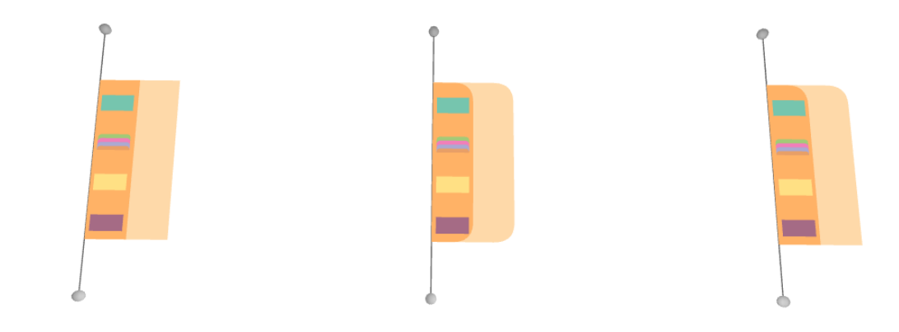

 It is possible to model a lyph within another lyph via explicit relationships, i.e., among its axis ends and lyph borders.

  To sketch an entire process or a subsystem within a larger scale lyph, i.e., blood flow in kidney lobus, one may use the `hostedLyphs` property. Hosted lyphs get projected on the container lyph plane and get pushed to stay within its borders.

 ```json
 {
    "id"         : "5",
    "name"       : "Kidney Lobus",
    "topology"   : "BAG",
    "hostedLyphs": [ "60", "105", "63", "78", "24", "27", "30", "33" ]
 }
  ```
   

### Lyph
 Lyphs in the ApiNATOMY lyph viewer are shown as 2d rectangles either with straight or rounded corners. A lyph defines the layered tissue material that constitutes a body conduit vessel (a duct, canal, or other tube that contains or conveys a body fluid) when it is rotated around its axis. 
 
 The shape of the lyph is defined by its `topology`. The topology value `TUBE` represents a conduit with two open ends. The values of `BAG` and `BAG2` represent a conduit with one closed end. Finally, the topology value `CYST` represents a conduit with both ends closed (a capsule). The images below show 2d and 3d representation of three types of lyphs: `TUBE`, `CYST`, and `BAG`, each with 3 layers.

 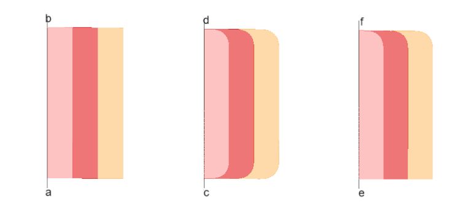

 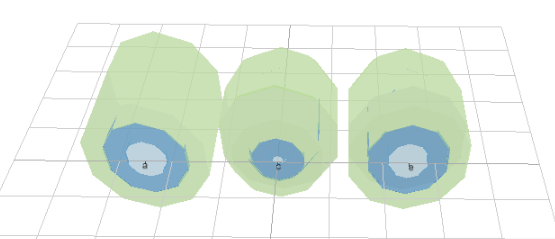

 In addition to the nodes and links created in the previous sections and a new link `k_l` with source node `k` and target node `l`, the code below produces a bag with two layers conveyed by the `k_l` link:

 ```json
 "lyphs": [
     {
       "id"         : "5",
       "name"       : "Kidney Lobus",
       "topology"   : "BAG",
       "external"   : "FMA:17881",
       "layers"     : [ "7", "6"],
       "scale"      : { "width": 50, "height": 50 },
       "conveyedBy" : "k_l"
     },
     {
       "id"       : "6",
       "name"     : "Cortex of Kidney Lobus",
       "topology" : "BAG"
     },
     {
       "id"       : "7",
       "name"     : "Medulla of Kidney Lobus",
       "topology" : "BAG"
     }
 ]
 ```

 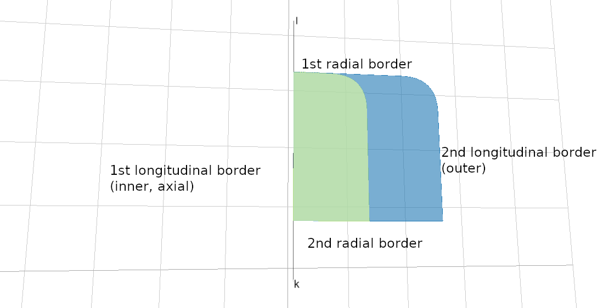
 
 The center of the axial border of the lyph (see [Lyph border](#lyph-border)) always coincides with the center of its axis. The lyph's dimensions depend on its axis and can be controlled via the `scale` parameter. In this example, the lyph's length and height are half the length of the link's length (50%). If you do not want a lyph size to depend on the length of its axis, assign explicit values to the properties `width` and `height`.
 Lyph's properties `thickness` and `length` refer to the anatomical dimensions of the related conduits. At the moment, these parameters do not affect the size of the graphical objects representing lyphs.
   
 The lyph above consists of 2 layers. A layer is a lyph that rotates around its container lyph. The lyph's layers are specified in the property `layers` which contains an array of layers. Each layer object is also aware in what lyph it works as a layer via its field `layerIn`. Similarly to other bi-directional relationships, it is sufficient to specify only one part of it in the model, the related property is inferred automatically.
 By default, all layers get the equal area within the main lyph. Since all layers have the same height as the hosting lyph, the area they occupy depend on the width designated to each layer. The percentage of the width of the main lyph's width a layer occupies can be controlled via the `layerWidth` parameter. For instance, the code below, set the outer layers of all lyphs in the neural system group (see the example in the [Entity](#entity) section) to occupy 75% of their total width.

 ```json
  {
     "id"    : "largeOuterLayers",
     "name"  : "Enlarged outer layers of neural system lyphs",
     "lyphs" : ["155", "150", "145", "140", "135", "160"],
     "assign": [
       {
         "path" : "$.lyphs[*]",
         "value": {
           "layerWidth": 75
         }
       }
     ]
  }
 ```

  A list of materials used in a lyph is available via its field `materials`, i.e.,:
 ```json
    {
        "id"       : "112",
        "name"     : "Lumen of Pelvis",
        "topology" : "TUBE",
        "materials": [ "9", "13" ]
    }
 ```
 
 Often a model requires many lyphs with the same layer structure. To simplify the creation of sets of such lyphs, we introduced a notion of the lyph template. A lyph with property `isTemplate` set to true, serves as a prototype for all lyphs in its property `subtypes`: such lyphs inherit their layers from the their `supertype`. 
 In the example below, six lyphs are defined as subtypes of a generic cardiac lyph which works as a template to define their layer structure.
 
 ```json
"lyphs": [
     {
       "id"        : "994",
       "name"      : "Cardiac Lyphs Prototype",
       "layers"    : [ "999", "998", "997" ],
       "isTemplate": true,
       "subtypes"  : [ "1000", "1001", "1022", "1023", "1010", "1011" ]
     },
     {
       "id"   : "1000",
       "name" : "Right Ventricle"
     },
     {
       "id"   : "1010",
       "name" : "Left Ventricle"
     }
] 
 ```

 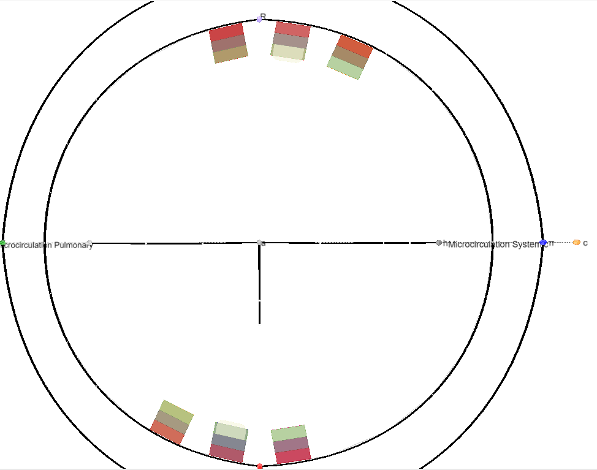
 
 Note that inheriting layer structure from the lyph template differs from assigning layers explicitly to all subtype lyphs, either individually or via the group's `assign` property. A lyph with the same ID cannot be used as a layer in two different  lyphs, that would imply that the same graphical object should appear in two different positions, and its dimensions and other context-dependent properties may vary as well. The code above instead implies that we replicate each of three template layers six times, i.e., 18 new lyphs are auto-generated and added to the model for the specification above.  
 
 It is possible to customize some of the `subtype` - `layer` pairs with the help of the context-dependent queries. For example, the code below

  ```json
 "assign": [
   {
     "path" : "$.[?(@.id=='1000')].layers[(@.length-1)]",
     "value": { "internalLyphs": [ "995" ] }
   },
   {
     "path" : "$.[?(@.id=='1010')].layers[(@.length-1)]",
     "value": { "internalLyphs": [ "996" ] }
   }
 ]
  ```
  assigns `internalLyphs` to two outer most layers of lyphs `1000` and `1010` while other auto-generated layers remain unchanged. These internal lyphs can be seen as yellow cysts on the image above.

 The pair of properties `subtypes` and `supertype` can be used to specify a generalization relationship among lyphs without replicating their layer structure or any other properties. To trigger the derivation of layer structure, it is essential to set the `isTemplate` property to `true`.
     
In addition to the link's `reversed` property that can be used to rotate the lyph it conveyed by 180 degrees, one can set the lyph's own property `angle` to rotate the given lyph around its axis to the given angle (measured in degrees). Finally, a boolean property `create3d` indicates whether the editor should generate a 3d view for the given lyph. The view gives the most accurate representation of a lyph but does not allow one to see its inner content.

The field `bundles`  points to the links that have to pass through the lyph.

### Border
 
 A flat shape such as lyph or region has a border. The border is an object that extends the class `Visual Resource` and inherits all properties from the class hierarchy: it can have its own ID, a name, a reference to an external source, etc. The owner shape can refer to its border via its `border` field.
 
 Practically, borders do not make much sense without their hosting entities. Hence, we auto-generate borders for all lyphs and regions in the model and merge inline objects defining border content within the hosting entity with the generated object. The modeller should only specify entities hosted by the border if the model implies the semantic relationships among the corresponding concepts.

 The lyph's border is closely related to its topology. The topology defines the types of its `radial` borders: `false` represents a border with open flow while `true` corresponds to closed borders. On each lyph border, i.e., the entire lyph perimeter, we distinguish 4 border segments: lyph's inner longitudinal (axial) border, first radial border, outer longitudinal border, and second radial border, roughly corresponding to the 4 sides of the lyph's rectangle. The axial border is always aligned with the lyph's axis (the link that conveys this lyph). All border segments can be accessed via the lyph border property `borders` which is always an array of 4 objects. Individual border objects may either remain empty or contain a reference to a `Link` resource that manages the content of the border. The link resource representing one of the border sides refers to its hosting border via the `onBorder` field.
 
 It is possible to place nodes and other lyphs on any of the border segments. 
 The `hostedNodes` property in the fragment below forces 3 nodes with the given identifiers to stick to the 2nd radial border of the Kidney Lobus lyph (see the screenshot illustrating the `hostedLyphs` property):
  
 ```json
 {
    "id"      : "5",
    "name"    : "Kidney Lobus",
    "topology": "BAG",
    "border"  : {
        "borders": [ {}, {}, {}, { "hostedNodes": [ "nPS013", "nLR05", "nLR15" ] } ]
    }
 }
  ```

 Similarly, in the next snippet, the model indicates that the 4th (2nd radial) border must convey the lyph with `id = "5"`.
 
 ```json
     {
        "id"      : "3",
        "name"    : "Renal Parenchyma",
        "topology": "BAG",
        "border"  : {
            "borders": [ {}, {}, {}, { "conveyingLyph": "5" } ]
        }
     }
  ```
 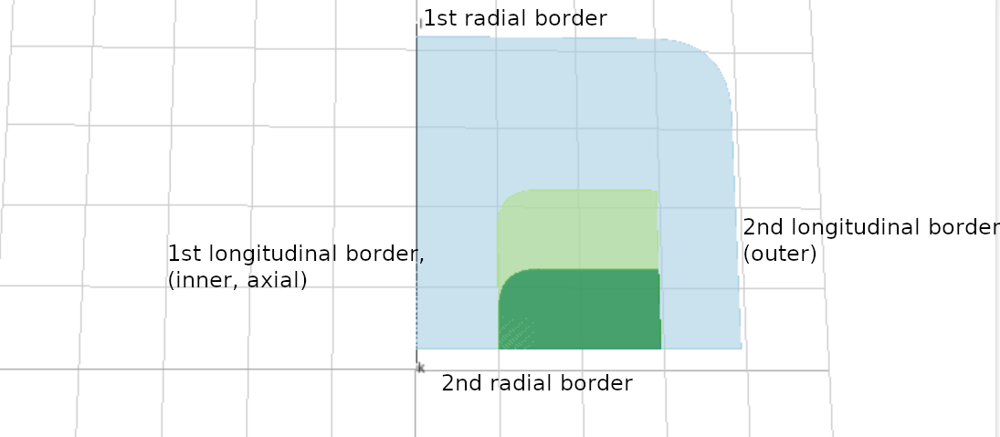 
 
 Here one may observe that the conveyed lyph is using the container lyph's border as its axis. To avoid a whole new level of complication in the modelling schema by supporting lyphs that rotate around border objects, we auto-generate implicit and invisible straight links that coincide with 4 sides of the lyph border.
      
## Material
 The ApiNATOMY model can contain definitions of materials, e.g.:
 ```json
    {
        "materials": [
           {
              "id"  : "9",
              "name": "Biological Fluid"
           },
           {
              "id"  : "13",
              "name": "Urinary Fluid"
           }
        ]
    }
 ```

 At the moment, we do not include material objects into the graph schematics.  Materials of a lyph can be displayed on the information panel if the `infoFields` property of the lyph is configured to show them.

## Coalescence

A coalescence creates a fusion situation where two or more lyphs are treated as being a single entity.

There are two types of coalescence, both describing material fusion. In both cases, coalescence can only occur between lyphs that have exactly the same material composition:

- `Connecting coalescence` represents a ‘sideways’ connection between two or more lyphs such that their outermost layer is shared between them. The visualisation of such a situation requires that only a "single" depiction of these layers is shown. Technically, we still use two visual objects which, however, are aligned in such a way that they appear as a single object (provided that they are of the same size).
- `Embedding coalescence` represents dropping of a contained lyph into a container lyph such that the outer layer of the contained lyph fuses with the container lyph. The visualisation of such a situation requires that only the container lyph is shown.

The `Coalescence` class, apart from the generic resource properties `id`, `name`, etc., defines fields `topology` and `lyphs` which the model author should use to specify the type of the coalescence, `CONNECTING` or `EMBEDDING` (default value is `CONNECTING`) and the coalescing lyphs, respectively. The field `lyphs` expects an array of coalescing lyphs. Although semantically the order of the lyphs in the connecting coalescence are not important, in the viewer, the first lyph is treated as a "master" - while connecting the graphical depictions of coalescing lyphs, all subsequent lyphs are pushed by the force-directed layout to approach the "master" lyph and realign their outermost layers to match the outermost layer of the first lyph. In the case of the embedded coalescence, the first lyph is expected to be the `housing` lyph.

If a coalescence resource is defined on abstract lyphs (lyph templates), it is considered abstract and works as a template to generate coalescences among lyphs that inherit the abstract lyphs.

The images below show the visualization of connecting coalescence: two coalescing lyphs, `Visceral Bowman's capsule` and `Glomerulus`, share a common outer layer, `Basement membrane`:

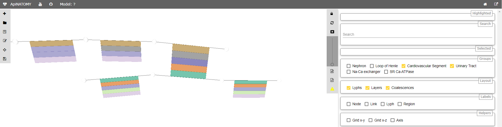

In the case of embedding coalescence, the outer layer of the embedded lyph blends with the layer of the housing lyph, we make it invisible:

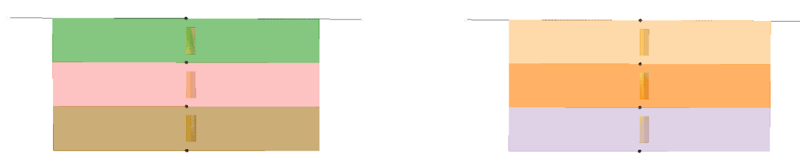


## Group
 A group is a subset of entities from the ApiNATOMY model (which can also be seen as a  group) that have a common semantic meaning and/or a distinct set of visual characteristics. A group can include `nodes`, `links`, `lyphs`, `materials`, and other `groups` (subgroups) via the properties with the corresponding names.
 
 In the example below, we define a group of blood vessels by joining two subgroups, arterial and venous vessels.
 
 ```json
    "groups": [
        {
          "id"    : "omega",
          "name"  : "Blood vessels",
          "groups": ["arterial", "venous"]
        },
        {
          "id"    : "arterial",
          "name"  : "Arterial",
          "nodes" : [ "nLR00", "nLR01", "nLR02", "nLR03", "nLR04", "nLR05" ],
          "links" : [ "LR00", "LR01", "LR02", "LR03", "LR04" ]
        },
        {
          "id"    : "venous",
          "name"  : "Venous",
          "nodes" : [ "nLR10", "nLR11", "nLR12", "nLR13", "nLR14", "nLR15", "nLR16" ],
          "links" : [ "LR10", "LR11", "LR12", "LR13", "LR14", "LR15" ]
        }
    ]
 ```

### Resource visibility rules
Since ApiNATOMY models typically consist of numerous resources, visualizing all of them at
the same time in the graph view is infeasible. Therefore, a set of resource visibility rules 
apply on graph vertices, edges, and lyphs. In the most trivial case, only resources included to visible
groups are shown on the screen. Group visibility is controlled via checkbox controls at the Control Panel.
However, group resources may have relationship dependencies affecting their visibility.
Moreover, for generated groups, a set of implicit inclusion rules applies.
Finally, various groups may include overlapping sets of resources or subgroups with conflicting 
visibility settings.

Regarding relationship-based constraints, the following visibility rules apply:
 * A graph edge (connectivity model link or scaffold wire) is visible if it is included to 
   a visible group and its source and target ends are also visible.
 * An edge that lies on a border is visible if the border is visible.
   The border is visible if its hosting shape (lyph or region) is visible.
 * A lyph is visible if a link it conveys is visible or it is a layer in a visible lyph.

### Generated groups
 When expanding group templates such as chains, implicitly declared groups are generated.
Such groups can be recognized by its properties "generated" set to True and "generatedFrom" pointing
to the template that provides rules for the group resource inclusion.

If a generated group includes a link, the following resources are also included to the group:
 * its conveying lyph,
 * its source and target ends,
 * its hosted nodes.

If a generated group includes a lyph, the following resources are also included to the group:
 * its layer lyphs,
 * its internal lyphs,
 * its internal nodes.

If a generated group includes a node, the following resources are also included to the group:
 * its clone nodes (copies of the node hosted by adjacent lyphs or their borders)
 * collapsible links that have the node as one of its ends.

Note that if someone wants to hide or show a subgraph, it is not necessary to list lyphs conveyed by the graph links, the lyphs are considered part of the link definition for that purpose. However, if one wants to be able to toggle a certain set of lyphs but not their axes, the lyphs should be included to some group explicitly.

### Dynamic groups
The viewer automatically analyzes an input model and creates dynamic groups with closed flow, i.e., 
sub-graphs topologically equivalent to a CYST. Such components are important and may represent anatomically meaningful 
systems such as neurons and neuron parts. The algorithm places discovered groups under the title `Dynamic groups`.  
A modeller can assign a meaningful name to a dynamic group by defining an empty group, i.e.,
 ```json
   {"id": "neuron-8", "name": "Neuron 8"} 
 ```
and pointing any lyph from this group to it via property `seedIn`, i.e., 
 ```json
   {
     "id": "snl18",
     "name": "Soma of SPR neuron in L1_Neuron 8 (kblad)",
     "seedIn": "neuron-8"
   }
 ```
### Graph
 Graph is the top-level group that in addition to all the group parameters contains a `config` object. The field is not part of the semantic physiology model but it can be used to define user preferences regarding the visualization of a certain model. For example, a field `filter` within this object is currently used to exclude resources with given identifiers from appearing in the relationship graph.
 ```json
"config": {
    "filter": ["6", "11", "12", "14", "15", "16", "17", "20", "21"]
}
 ```
 Among other properties that can be stated here are the default label fields.

## Group templates
 Group template is a generic concept to encapsulate resource definitions that result into automatic generation of subgraphs with certain structure and/or semantic meaning. A distinct property of the resource objects of this type is a readonly `group` property that establishes the relationship between the template and the generated group.

 Another currently supported property of this generic class is `length` that sets in percentage the desired length of the maximal path in the generated group. This property is used to compute the default link length and, consequently, control the size of the lyph shape conveyed by the link.

 There is ongoing work on supporting visual resource styles that one will be able to refer to from groups or group templates to define the appearance of links, lyphs and nodes in the entire (auto-generated) group.

### Chain
This template instructs the model generator to create a chain from an ordered list of lyphs, i.e., 
a linear concatenation of advective edges that convey the material of the innermost layer of these conveying lyphs. This requires the lyphs in the ordered list to have their innermost layers constituted of the same material.

The listing below shows an example of chain template definition:

```json
{
  "id": "c1",
  "lyphs": ["200", "203", "204", "205", "206", "207", "208", "209", "210", "211", "212", "213", "214", "215", "216"],
  "root": "s",
  "leaf": "t"
}
```

Apart from the list of `lyphs`, the template includes `root` and `leaf` properties 
to name the source and the target nodes of the chain.
They are helpful to integrate the chain as a fragment into a larger model graph.
If the root is not explicitly defined, an error message is issued (an artificial node is created to  
visualize the chain, but semantically such model is likely to be incorrect and has to be revised by the author).

Alternatively, instead of providing of lyphs to connect to a chain, a modeller can provide an abstract lyph
via the property `lyphTemplate` and indicate the number of levels in a generated chain via the property
`numLevels`. For example, the template below will generate a chain of 5 levels conveyed by identical lyphs with 3 layers:
```json
{
    "chains": [
       {
         "id": "axonal",
         "name": "Axonal omega tree",
         "root": "a",
         "numLevels": 5,
         "lyphTemplate": "neuronBag"
       }
     ],
    "lyphs": [
       {
         "id": "neuronBag",
         "isTemplate": true,
         "topology": "BAG",
         "layers": ["cytosol", "plasma", "fluid"]
       }
     ]
}
```
Yet another option to define (or customize a chain), is to use property `levels` that accepts link references (
or partial specifications):

```json
{
  "id"          : "c1",
  "root"        : "a",
  "levels"      : [
    {"source": "a", "target": "b", "conveyingLyph": "lyph1"},
    {"source": "b", "target": "c", "conveyingLyph": "lyph2"},
    {"source": "c", "target": "d", "conveyingLyph": "lyph3"},
    {"source": "d", "target": "e", "conveyingLyph": "lyph4"},
    {"source": "e", "target": "f", "conveyingLyph": "lyph5"}
  ]
}
```
Note that if `numLevels` and `lyphTemplate` are provided, they can be used to generate default levels which then 
can be replaced by specified links via the `levels` field. For example, if one wants to define a chain with 5 levels conveyed by identical lyphs,
and replace 3rd level with another lyph, only the 3rd level link can be provided: 
```json
{
    "id"           : "c1",
    "root"         : "a",
    "numLevels"    : 5,
    "lyphTemplate" : "neuronBag",
    "levels"       : [{}, {}, {"conveyingLyph": "lyph3"}, {}, {}]
}
```
Since it may be tedious for modelers to specify all `levels` via defining links  
(i.e., defining source and target nodes, connected links, and conveying lyphs at each level), 
for Excel spreadsheets we provide a syntactic sugar to simplify definition of chains 
passing via given nodes. This is done via the `levelTargets` property that expects a string with pairs
of level index followed by a corresponding level target node, i.e., spreadsheet field `0:n1,3:n3,5:n5` 
is a shorthand notation for 
```json
"levels" : [ {"target": "n1"},{},{"target": "n3"},{},{"target": "n5"}]
```
It is sufficient to indicate only level target nodes as this does not cover only the start node of the 
first level which is expected in the chain's `root` property.


Yet another common variant of chain definition is via `housingLyphs` or `housingChain` properties.
The former is used list a set of lyphs that house the chain, the latter expects a reference to another chain whose
level lyphs house the chain. 
```json
{
  "id"          : "c1",
  "root"        : "a",
  "lyphTemplate": "lyph",
  "housingLyphs": ["lyph1", "lyph2", "lyph3", "lyph4"]
}
```

If a `housingChain` reference is used, it is possible to indicate the index range to 
define the part of the housing chain that houses the current chain lyphs. Moreover, 
if the housing chain is generated, and the identifiers of layers are not available, the `housingLayers` property can be 
used to refer to the indices of the layers in housing lyphs that embed the chain levels. 
```json
{
  "id"           : "t1",
  "root"         : "n1",
  "leaf"         : "n2",
  "lyphTemplate" : "229",
  "housingChain" : "c1",
  "housingRange" : {"min": 0, "max": 7},
  "housingLayers": [6,3,4,6,6,6,6]
}
```
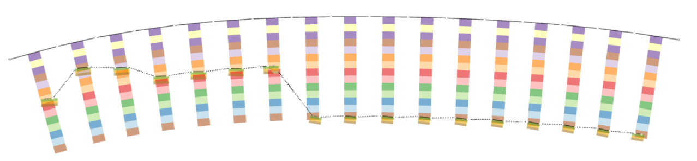

### Tree
Branching underlies the formation of numerous body systems, including the nervous system, the respiratory system, many internal glands, and the vasculature. An `omega tree` is a template to create a rooted tree data structure (a graph in which any two vertices are connected by exactly one path, and one node is designated the root) that we use in ApiNATOMY to model branching systems.

The `Tree` resource class allows users to specify a root of the tree via an optional property `root` that can point into an existing node. If the root node is not specified, it is either automatically generated or assigned to coincide with the source node of a link that represents the first level of the tree.

We define the `level` of a tree branch as the number of edges between the target node of the link and the root. A user may specify the required number of levels in a tree via its optional property `numLevels` which expects a positive integer value. Given the desired number of levels, the ApiNATOMY lyph viewer can generate a `group` (a read-only property that refers to a `Group` resource and encompasses all necessary nodes and links) to represent the tree. If the property `lyphTemplate` points to an abstract lyph, the generated links for each tree level then convey lyphs which are subtypes of this template.

Alternatively, the tree branches can be specified, partially or fully, via the property `levels` which expects an array of partial or complete link definitions corresponding to the tree levels. If this array contains an empty object, the missing tree level branch is auto-generated. If instead it points to an existing link, the corresponding link then becomes the branch of the tree. If `source`, `target`, or both ends of the link resource are not specified, they are auto-generated. Otherwise, it is expected that incident links (connected tree branches) share a common node; the tool will issue a warning if this is not the case.

```json
"trees": [
    {
         "id"          : "axonal",
         "name"        : "Axonal omega tree",
         "root"        : "a",
         "numLevels"   : 5,
         "lyphTemplate": "neuronBag"
    },
    {
         "id"          : "UOT",
         "name"        : "Urinary Omega Tree",
         "root"        : "b",
         "levels"      : ["lnk1", "lnk2", "lnk3", "lnk4", "lnk5", "lnk6", "lnk7", "lnk8", "lnk9", "lnk10",
            "lnk11", "lnk12", "lnk13", "lnk14", "lnk15", "lnk16", "lnk17", "lnk18", "lnk19", "lnk20", "lnk21"],
         "branchingFactors": [1, 1, 2, 1, 1, 1, 3, 3, 20, 8, 9, 8, 9]
    }
]
```

Our [examples](./examples.html) section demonstrates in full detail how to define omega trees using both `lyphTemplate` and `levels` properties. A combination of both approaches may help modellers to reduce an effort while specifying multi-level trees where the majority of the branches convey the same lyphs (involve the same tissue structures) while certain levels either convey different lyphs or are characterized by unique features that need to be modelled in a special way.

The trees defined this way actually do not have any branching, they look like liner chains of enumerated links. We refer to such trees as `canonical`, meaning that they define the basic structure necessary to generate a branching tree that models an organ or a physiological subsystem. The branching can happen at each level of the canonical tree definition, and the number of branches per level can be specified in the `branchingFactors` array. The size of the array does not need to coincide with the size of the `levels` array - branching stops at the last level with branching factor greater than 1.

A user may define a required number of branching tree instances produced from the canonical tree specification. This is done with the help of the boolean property `numInstances`. The generated subgraphs representing  branching tree instances are available via the read-only property `instances` in the expanded ApiNATOMY model. The lyphs for a tree instance are assigned `create3d` property, i.e., the generated tree instance can be visualized using solid 3d lyph renderings.

In the case of trees with branches that convey lyphs derived from a common `lyphTemplate` pattern, we can use the `topology` property of the lyph template to define the overall topology of the tree.
Generally, lyphs originating from a lyph template inherit its topology. However, the lyphs conveyed by the tree edges work as a single conduit with topological borders at the start and the end levels (root and leaves) of the tree compliant with the borders of the lyph template. Thus, the topology of the lyphs on tree edges is defined according to the table below:

| Lyph template | Radial borders | Tree |Level 1|Levels 2..N-1| Level N|
|:-------------:|:--------------:|:----:|:-----:|:-----------:|:------:|
| TUBE          | both open      | TUBE | TUBE  | TUBE        | TUBE   |
| BAG           | 1st closed     | BAG  | TUBE  | TUBE        | BAG    |
| BAG2          | 2nd closed     | BAG2 | BAG2  | TUBE        | TUBE   |
| CYST          | both closed    | CYST | BAG2  | TUBE        | BAG    |

A tree template can be used to reduce repetition and possibility of error by automating the creation of a tree and associated conveying lyphs to distribute/embed conveying lyphs over an ordered list of housing lyphs. If the `housingLyphs` list is provided in a tree template, the number of levels is set to equal the size of this list, and a tree group with no branching is generated, then each level of the generated tree is bundled with the corresponding housing lyph as follows:
* The edges for the non-terminal housing lyphs span the housing lyph completely. The nodes of these edges anchor on the radial borders of the outermost layer of the housing lyph, i.e. they run parallel to the longitudinal borders. For the first and the last lyphs in the `housingLyphs` set, only one node anchors on the radial border, the other "hangs free" inside the housing lyph.
* The housing lyph is bundled with the tree level via its property `bundles`. Respectively, the level link refers to the housing lyph via its property `fasciculatesIn`
* Finally, the embedded coalescence resource is created to link the housing lyph and the lyph conveyed by the bundled link.

The fragment below shows an example of housed tree definition. More details about this model can be found in the [Examples](./examples.html) section (Bolser-Lewis map)
```json
{
  "id": "t1",
  "name": "Neuron",
  "lyphTemplate": "229",
  "housingLyphs": ["202", "201", "200", "203", "204", "205", "206", "207", "208", "209", "210", "211", "212", "213", "214", "228"]
}
```

The image below shows a neuron tree aligned along the chain of housing lyphs.

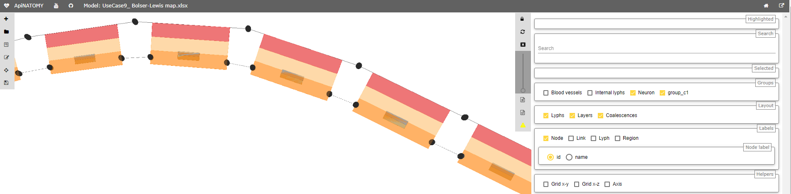

Semantically, lyphs in contiguous chains of lyphs have a common border, but because the chosen ApiNATOMY visualization approach depicts lyphs as centered icons with separate borders, the alignment of an omega tree that respects the border constraints set by the rules above requires the non-terminal level link ends to be placed on two separate lines. To address this problem, we rely on the node `clones` and `collapsible` links (drawn as dashed lines) that connect two copies of the same node. Developers who plan to work with the ApiNATOMY models should keep this in mind when traversing the ApiNATOMY graph - two semantically adjacent graph links can be separated by an auxiliary collapsible link that does not convey any lyphs. Hence, to access a link that models the next level in the generated tree group, starting from the tree level link `L1`,one may need to use the following 3 step traversals:

```L1.target.clones[0].sourceOf => L2```

Here, `L1.target` gives the target node of `L1`, then `clones[0]` field gives a reference to its clone (there can be more clones of the same node as this mechanism is not limited by the canonical tree level alignment), and, finally, `sourceOf` field would provide the following link, `L2`.

For the transition in the reverse direction, the similar path can be used via the opposite `cloneOf` field that links the cloned node to its prototype:

```L2.source.cloneOf.targetOf => L1```


### Channel
The `Channel` resource class provides fields to define a template that will instruct the model generator to create specialized assemblies (groups, subgraphs) that represent membrane channels incorporated into the given housing lyphs.

To create membrane channel components, a model author provides:
- an identifier for the channel alone with optional characteristics shared by all ApiNATOMY resources, i.e., name, external annotations, etc.;
- identifiers of housing lyphs. A `housing lyph` is a lyph of at least three layers representing some cell or organelle (e.g. Sarcoplasmic Reticulum) such that the middle layer of this lyph is a membrane;
- the material payload that is conveyed by the diffusive edge;

The identifiers of the housing lyphs and materials conveyed by the diffusive edges of the channel are specified in the resource properties `housingLyphs` and `materials`, respectively.
Alternatively, a lyph can refer to the channel it houses via its property `channel`.

Given these data, the model generator creates three tube lyphs representing the three segments of the membrane channel (MC): `internal`, `membranous` and `external`. Each of the MC segments consists of three layers as follows:
- innermost, or the content;
- middle, or the wall;
- outermost, or the same `stuff` (material) as the lyph that contains it;
The group assembly generated given such a template will include 23 resources (4 nodes, 3 links, 3 lyphs with 3 layers each, 3 coalescences, and a group resource that encompasses nodes, links and lyphs of the channel instance). If the housing lyph is a template, this number of resources is then replicated for each channel instance housed by a lyph instance that is a subtype of the template.

The three MC segments are placed (housed) respectively in:
- the innermost layer of the housing lyph;
- the second layer of the housing lyph, which must be constituted of material of type membrane
- the third layer of the housing lyph.
To fulfill this requirement, we automatically set constraints that require channel nodes to be hosted by the borders of the layers of the housing lyph.

The third layer of each MC segment undergoes an `embedding coalescence` with the layer of the housing lyph that contains it.
Each of the three MC segments conveys a `diffusive edge` such that both nodes of the edge conveyed by the MC segment in the second (membranous) layer are shared by the other two diffusive edges.
Diffusive edges are associated with the links that convey the membrane channels (i.e., the link's `conveyingType` is set to `DIFFUSIVE`) and the material in the channel object is copied to the `conveyingMaterials` property of the link.

The images below show two membrane channels, `mc1: Na-Ca exchanger` and `mc2: SR Ca-ATPase`, which are housed by the abstract lyphs (templates) with IDs 63 and 60: `Myocyte` and `Sarcoplasmic reticulum`, respectively.
The first image shows abstract assemblies, the second image shows the instances of these assemblies housed by two lyph instances derived from the abstract `Myocyte` and `Sarcoplasmic reticulum` lyph templates.

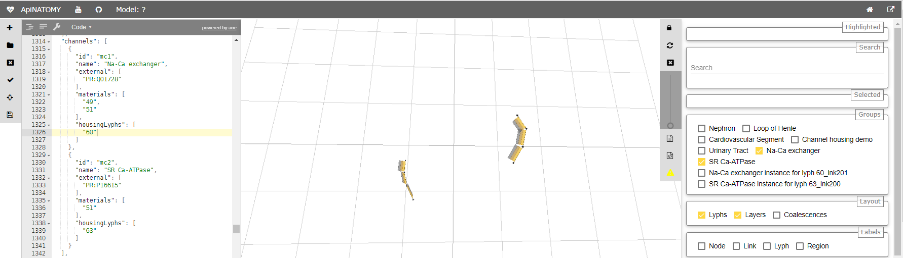
 
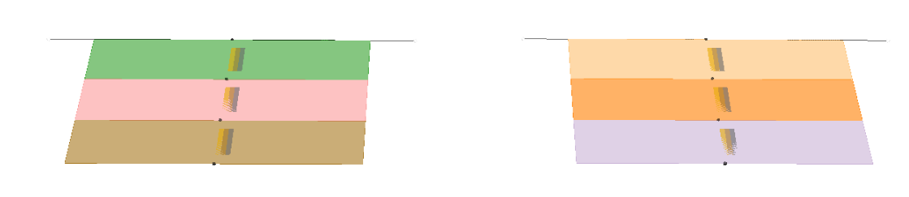

As one can see, channels are defined in a minimalistic way, but may cause the model generator to automatically create a potentially large number of resources, the modeller should keep this in mind to avoid state space explosion.

