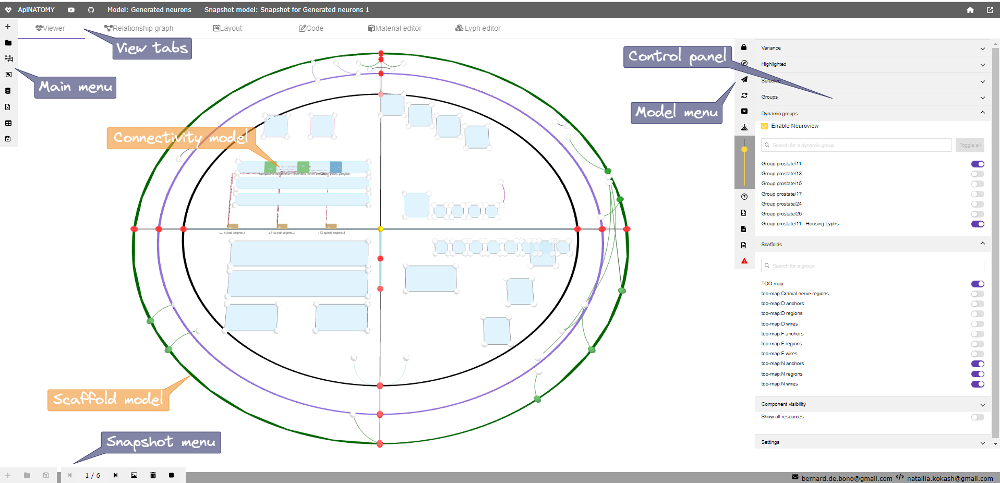
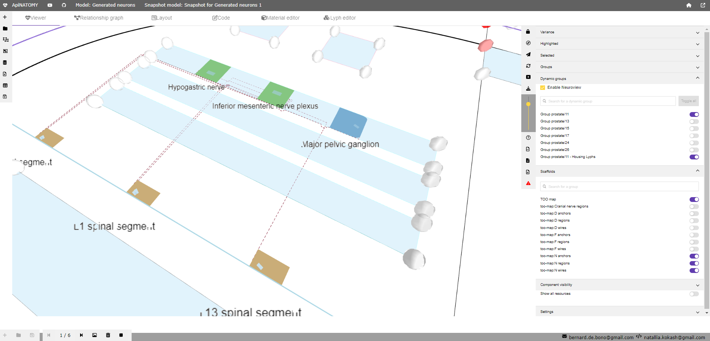
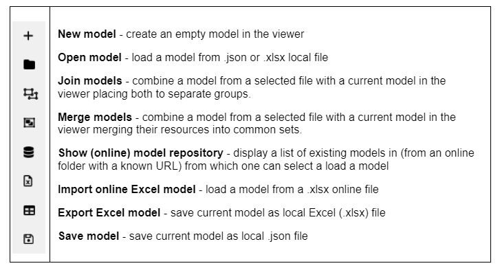
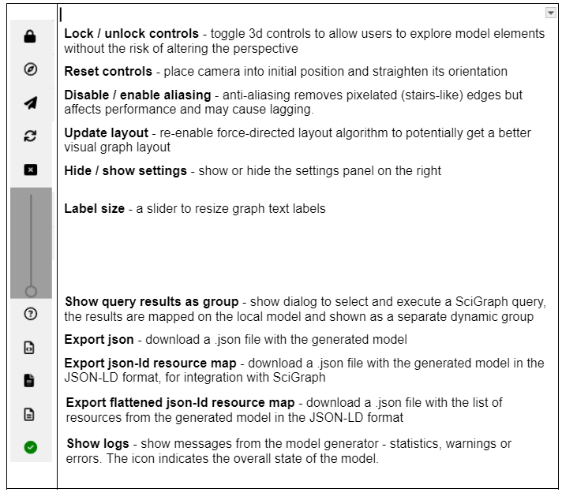
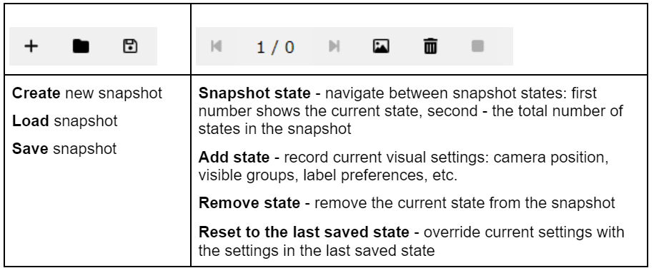
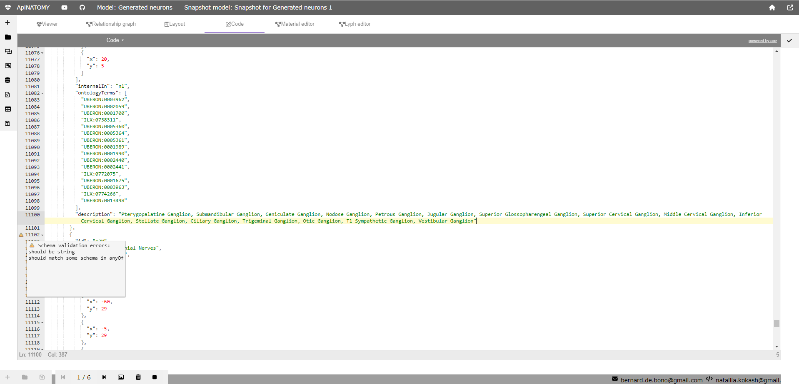
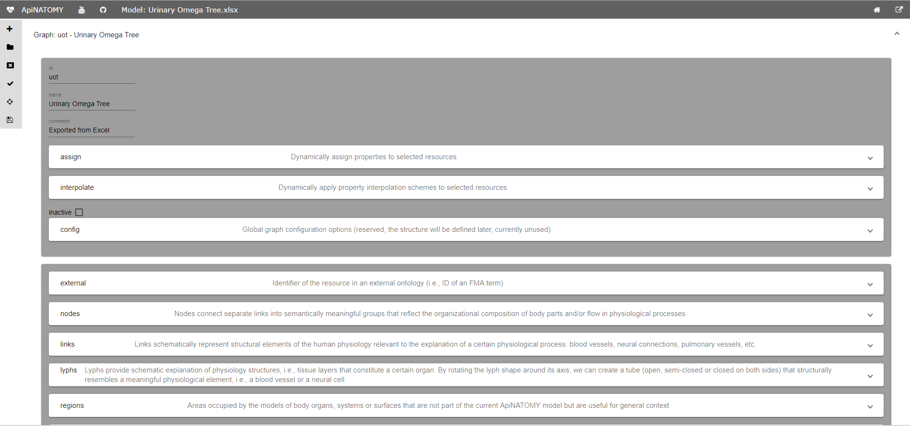
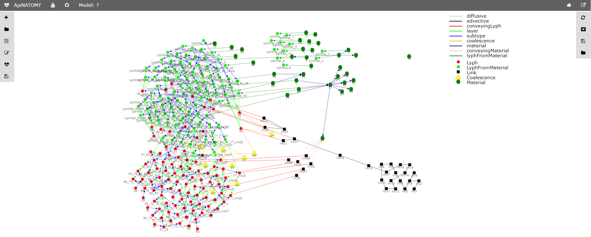

# Overview
 
The ApiNATOMY lyph viewer is a web application that shows 3d schematics of physiology models. 
It consists of the following components:

* **Viewer** canvas that features a dynamic graph rendered using a 3D force-directed layout algorithm.
* **Control panel** that allows users to change parameters of the viewer and select parts of the model to display.
* **Relationship graph** helper component that shows selected relationships among key model resources. This viewer 
  operates on the generated model and hence can be used to inspect derived (auto-generated) resources.  
* **Model editing tools** 
  * **Code editor** is a component that shows code of the currently opened ApiNATOMY JSON specification. It is the 
    most flexible editing tool but requires technical understanding of the ApiNATOMY schema and model specification conventions.         
  * **Layout editor** allows users to associate physiology model resources with scaffold resources 
  to specify their position within larger body regions. 
  * **Material editor** is a GUI for defining chemical compounds and basic tissue elements used throughout  
    physiology models.
  * **Lyph editor** is a GUI for defining key structural resources in ApiNATOMY, *lyphs*, which are layered 
    compartments composed of materials or other lyphs and represent biological organs or systems.
  * **Chain editor** is a GUI for defining templates that get expanded to generate *chains*, i.e., sequences
    of model graph links conveying lyphs.  
  * **Coalescence editor** is a GUI editor for defining pairs (sometimes, sets) of lyphs with overlapping layers that 
    enable exchange of fluid materials.  
* **Toolbars**
  * **Main toolbar** allows users to create, load, compose and export data models from the local file system,
    online repository or a given URL. 
  * **Model toolbar** provides controls for the current graphical scene. It allows users to disable camera, reset it to the 
    initial position, toggle antialising effect in WebGL images, show/hide the control panel and adjust label font. 
    Moreover, there are controls in this menu to import external models reused in the current one, and export the generated model 
    and resource map for further use or integration with resources like SciGraph. 
  * **Snapshot toolbar** allows users to save and instantly restore selected scenes. A scene consists of a number of
    visible groups in the current model, camera position and enabled combination of settings parameters.  
In addition to the aforementioned components, the web application includes header and footer with relevant project information.
 

The left-side menu enables users to load models to the viewer and save changes in a current model if they were made by 
means of built-in editors.

The right-side menu provides controls for the graphical viewer and allows users to analyze and export generated models
for integration with external resources such as SciGraph.

The bottom menu consists of two parts: 
* the first part provides operations to create, load and save snapshot models;
* the second part provides controls to manage states of the current (created or loaded) snapshot model; 

## Model input

The lyph viewer accepts as input a JSON-based object that defines ApiNATOMY resources, see [model](./model.html) section for more 
detail. The model can be edited using external tools or with the help of a build-in JSON editor and resource editors within 
the app.

The image below shows an integrated ACE-based JSON editor. The editor uses the ApiNATOMY JSON Schema for interactive validation - 
the lines that violate the schema model are marked with error or warning signs.

Alternatively, the input model can be edited with the help of the form-based editor as shown in the image below. The fields in the form are also based on the ApiNATOMY JSON schema and are preconfigured to assist the modeller with the choice of correct options, i.e., multi-selection fields that expect references to lyphs, show all suitable lyphs in the model.

Users that prefer working with a table-style data, can define an ApiNATOMY model using Excel spreadsheets.
The lyph viewer app can open .xlsx files and convert their content to a corresponding JSON-based model.
The recognized Excel format should specify ApiNATOMY resources in separate pages named after the Graph's fields, namely, `lyphs`, `materials`, `links`, `nodes`, `coalescences`, and `groups`. Each of the pages can contain columns named as the corresponding resource class properties, i.e., `id`, `name`, `external`, `conveyingLyph`, etc. for the class `Lyph` in the page `lyphs`. In the Excel lyph specification, one can assign content to a lyph border using columns `inner`, `radial1`, `outer`, and `radial2`; the content of these columns is then mapped to the property `border.borders` in the JSON specification which defines an array of 4 lyph borders.

A modified model must be saved using the dedicated button on the left hand menu panel. After that it is processed as described in the [Model assembly](#Model assembly) section below and an in-memory expanded model with auto-generated resources is created. This model is then visualized in the main canvas. One can also serialize this model using the menu items from the right-hand panel - the model can be either stored in a file as it is, or one can opt to serialize it in a form of a dictionary where the top object lists all resources with their unique identifiers as keys.

Sample ApiNATOMY models, including test models used in this documentation, can be found in the project's [repository at GitHub](https://github.com/open-physiology/open-physiology-viewer/tree/master/test/data).

## Model assembly
The users define key resources, their relationships, and layout constraints in the ApiNATOMY JSON format.
Naturally, these models may be incomplete or incorrect (i.e., contain typos,
undefined references, or unexpected values). We tried to make the format as flexible as possible,
many errors will be tolerated and some will be auto-corrected.
The tool logs errors (in red), warnings (in yellow) and important actions on the model post-processing (in black) into your browser console, you can typically open it with shortcuts:
on Windows and Linux: *Ctrl + Shift + J*, on Mac: *Cmd + Option + J*.

Below we describe key stages in user model post-processing in order to prepare it for visualization.
Model authors aware of the post-processing procedures are more likely to understand the causes of
wrong layouts and adjust their models accordingly:

1. Many resources that domain experts need for modelling are abstract assemblies of physiology subsystems (materials, cells, neuron pathways). It is convenient to specify such resources once and place them to the context they are used in as many times as needed. On the other hand, the ApiNATOMY model viewer creates a visual artifact for each unique visual resource (lyph, node, link) in the model. Hence, the first step is to replace the abstract templates with resource instances that inherit the majority of their characteristics from the templates. The tool identifies references to materials and lyph templates in all the fields that are expected to contain lyphs as building parts, automatically creates lyph instances with necessary characteristics and replaces abstract references with instance references. All derived or cloned resources within this step can be overviewed with the help of the [relationship graph](#Relationship graph).

2. If tree objects are present in the model, we generate tree-like graph structures and include all
created resources (nodes, links, lyphs, etc.) to the main graph (or a parent group containing the tree for nested models). The procedure replicates the tree lyph template to all generated edges (links) and assigns their topology to define overall boundaries of the tree-like conduits. At the end of this stage, the lyph template
is linked to the newly created blank lyphs via its `subtypes` property.
Check our [example](./examples.html) section for a run-through scenario with tree definitions.

3. At the next step, we process lyph templates: all subtypes of a lyph template inherit
 its `layers`, `color`, size-related properties, namely, `scale`, `height`, `width`, `length`,
 and `thickness` (unless they are overridden for the lyphs individually), `external` annotations, constituent `materials`, and auxiliary fields such as `comments` and `create3d`.

4. After auto-creating resources originating from tree and lyph templates, the model's graph structure is almost ready to be visualized. Hence, we create ApiNATOMY model objects and replace string identifiers with corresponding object references. Lyph and region borders are auto-created and merged with user-defined border content. Missing links and nodes for internal lyphs are also auto-created.
 By default, they are invisible. However, their presence is required for
 lyph positioning and sizing, they can also be accessed and customized via the JSONPath `assign` expressions.  We also perform group inclusion analyses at this stage and include nested group resources into parent groups.

5. As the result of the previous step, the main graph has a complete map of all model resources
regardless of where they were defined, i.e., all references can be resolved. If the tool detected IDs without corresponding resource definitions, we will auto-generate such objects setting their `ID` and `class` properties, all other parameters will be set to default values as defined in the
[ApiNATOMY JSON Schema](../schema/index.html).

6. To be able to fully connect related resources, we synchronize symmetric properties.
In a model, a user may specify, for example, that `A` has a layer `B` and that `C` is a layer in `A`,
hence `A` actually has two layers, `B` and `C`. At this stage, we analyze and integrate related
definitions into a complete and consistent model.

7. After that we process model customization via the JSONPath queries in `assign` and `interpolate` properties. This is done in two steps:
.. 1. we create dynamic relationships by assigning `relationship` fields, i.e., `layers=["B"]`. The tool will replace IDs in these fields with object references (thus, only IDs of known objects should be used in `assign` expressions, unresolved IDs will be ignored).
.. 2. we complete model customization by assigning qualitative properties to resources selected
 by JSONPath queries for every resource in the model with `assign` and `interpolate` properties.

## Relationship graph
The relationship graph is an auxiliary tool that allows users to trace the resource derivation process described above and visually inspect the relationships among the key resources in the model. In this viw, all resources are represented by graph nodes (visualized using colored shapes according to the type of the resource) while their relationships correspond to the graph links (visualized using colored lines where each color stands for a certain type of the relationship).

The nodes in the relationship graph are organized using the so called `group-in-a-box` layout, which clusters nodes based on their class and creates centers of attraction for each cluster. The area occupied by a cluster depends on its size. Be default we use a setting for the group-in-a-box algorithm that allocates cluster areas based on the treemap pattern.

The group-in-a-box algorithm creates a good initial graph layout. It is used in a combination with the `sticky` force-directed technique when the program reassigns the nodes coordinates when the user drags them to a different location. Hence, users are free to rearrange the nodes in a way that makes understanding the model or tracing certain derivation chains easier.

An any moment, the positions of the nodes in the graph can be saved and reloaded using the dedicated buttons from the right-hand panel.
 The file created at this process contains only node identifiers with the corresponding coordinates. To avoid compatibility issues when a user tries to load a relationship graph coordinates after modifying an ApiNATOMY model, we do not store other information such as node and link classes/types. Nodes which do not have saved coordinates in a certain file simply remain in their initial locations.
 Note that switching the view modes between the relationship graph and the main ApiNATOMY visualization resets the relationship graph node positions.