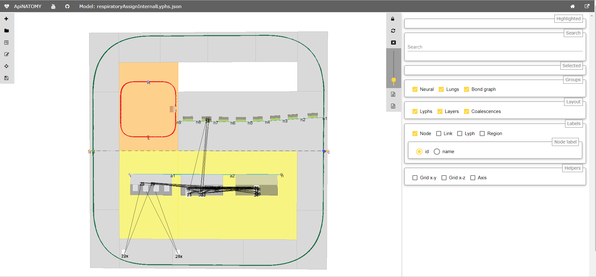

# Overview
 
 
 
The ApiNATOMY lyph viewer shows 3d schematics of physiology models.
The lyph viewer is a graphical component that consists of

* a canvas that features a dynamic graph rendered using a 3D force-directed layout algorithm;
* a control panel that allows users to change parameters of the viewer and select parts of the model to display.
 
The use of the ApiNATOMY lyph viewer component is illustrated via the test application that allows the user to load an ApiNATOMY data model from the local file system. In addition to the aforementioned component, the demo application includes:
 
* a header and a footer with relevant project information;
* a toolbar that allows the user to import, edit, preview and export the data model, as well as to switch the application view modes;
* an integrated JSON editor to overview, analyze and modify the chosen data model;
* a dedicated form-based resource editor for assisted editing of model resources;
* an svg-based viewer that helps users to overview the structural relationships among model resources, including derived (auto-generated) resources.

Sample ApiNATOMY models, including test models used in this documentation, can be found in the project's [repository at GitHub](https://github.com/open-physiology/open-physiology-viewer/tree/master/test/data).

## Model assembly
The users define key resources, their relationships, and layout constraints in the ApiNATOMY JSON format.
Naturally, these models may be incomplete or incorrect (i.e., contain typos,
undefined references, or unexpected values). We tried to make the format as flexible as possible,
many errors will be tolerated and some will be auto-corrected.
The tool logs errors (in red), warnings (in yellow) and important actions on the model post-processing (in black) into your browser console, you can typically open it with shortcuts:
on Windows and Linux: *Ctrl + Shift + J*, on Mac: *Cmd + Option + J*.

Below we describe key stages in user model post-processing in order to prepare it for visualization.
Model authors aware of the post-processing procedures are more likely to understand the causes of
wrong layouts and adjust their models accordingly:

1. If the tree objects are present in the model, we generate tree-like graph structures and include all
created resources (nodes, links, lyphs, etc.) to the main graph (or a parent group containing the tree for nested models).
The procedure replicates the tree lyph template to all generated edges (links) and assigns their topology to define overall boundaries of the tree-like conduits. At the end of this stage, the lyph template
is linked to the newly created blank lyphs via its `subtypes` property.
Check our [example](examples) section for a run-through scenario with tree definitions.

2. At the next step, we process lyph templates: all subtypes of a lyph template inherit its layer structure,
color and size properties (unless they are overridden for the lyphs individually).

3. After auto-creating resources originating from tree and lyph templates, the model's graph structure is almost ready to be visualized. Hence, we create ApiNATOMY model objects and replace all IDs with references. Lyph and region borders are auto-created and merged with user-defined border content. Missing links and nodes for internal lyphs are also auto-created.
 By default, they are invisible. However, their presence is required for
 lyph positioning and sizing, they can also be accessed and customized via the JSONPath `assign` expressions.
 We also perform group inclusion analyses at this stage and include nested group resources into
 parent groups.

4. As the result of the previous step, the main graph has a complete map of all model resources
regardless of where they were defined, i.e., all references can be resolved. If the tool detected IDs without
corresponding resource definitions, we will auto-generate such objects setting their `ID` and `class` properties, all other parameters will be set to default values as defined in the
[ApiNATOMY JSON Schema](../schema/index.html).

5. To be able to fully connect related resources, we synchronize symmetric properties.
In a model, a user may specify, for example, that `A` has a layer `B` and that `C` is a layer in `A`,
hence `A` actually has two layers, `B` and `C`. At this stage, we analyze and integrate related
definitions into a complete and consistent model.

6. After that we process model customization via the JSONPath queries in `assign` and `interpolate` properties. This is done in two steps:
 ..1. we create dynamic relationships by assigning `relationship` fields, i.e., `layers=["B"]`. The tool will replace IDs in these fields with object references (thus, only IDs of known objects should be used in `assign` expressions, unresolved IDs will be ignored).
 ..2. we complete model customization by assigning qualitative properties to resources selected
 by JSONPath queries for every resource in the model with `assign` and `interpolate` properties.