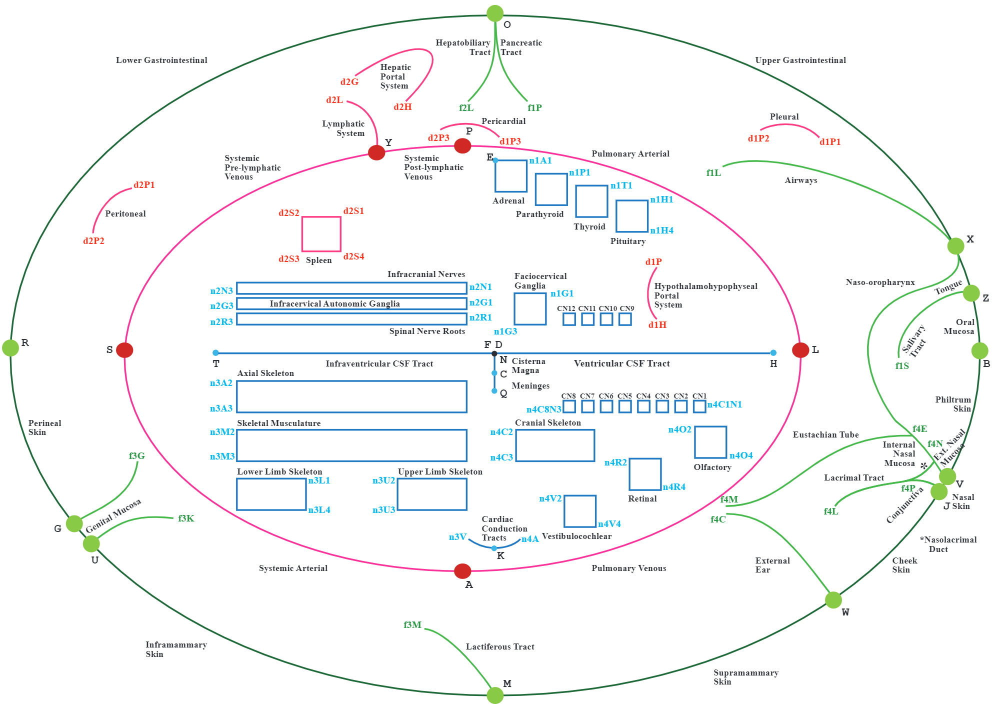
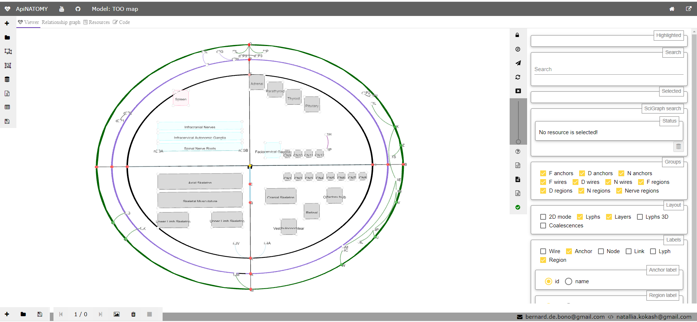
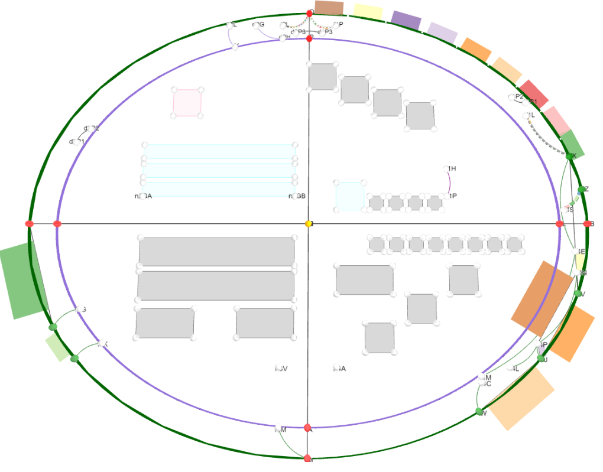

# Scaffold model

## Anchor
 Anchors are graph vertices that help to position and shape connectivity model parts.
 An anchor represents a vertice and its class `Anchor` extends the generic class `Vertice`, similarly to 
 the class `Node` in the connectivity model. Two of basic properties in an anchor object definition 
 are `sourceOf` and `targetOf` which point to the wires incoming to and outgoing from this anchor. 
 
 A boolean property `cardinal` can be used to mark important anchors that have special positioning 
 constraints in scaffold models such as `Too-map`.

 Analogously to nodes, the position of an anchor is defined via the `layout` property. However, anchor coordinates 
 are 2-dimensional: 
 ```json
{
 "anchors": [
  {
   "id": "L",
   "name": "LUNG CAPILLARY",
   "cardinal": true,
   "layout": {
    "x": 90,
    "y": -10
   },
   "color": "#FF0000"
  }
 ]
}
```
 An anchor can also be bound to a wire via the properties `hostedBy` that provides a reference to a wire and 
`offset` that specifies the offset in percentage from the start of the wire.
 Placing an anchor to the area occupied by a region is done via its field `internalIn`.
 
 If an anchor resource is used as part of region definition in region's property `borderAnchors`, 
 it will supply an auto-assigned read-only property `onBorderInRegion`. 
 Another read-only property `partOf` indicates to which scaffold the anchor belongs.

 A connectivity model node bound to an anchor can be retrieved via the anchor's property `anchoredNode`.

## Wire
 Wires are graph edges that help to position and shape connectivity model parts. 
 Since a wire represents an edge and its class `Wire` extends the generic class `Edge` similarly to links,
 two of its fundamental properties are `source` and `target` that point to the edge source and target 
 vertices (anchors). Unlike links, wires do not convey lyphs.
 
 An important property that defines the shape of the wire is `geometry`. It can take the same values as 
 link's geometry, namely, `link` | `arc`| `spline` | `invisible` | `semicircle` | `rectangle`, and, in addition, 
 `ellipse`, which defines an elliptic curve without source or target. 
 For elliptic wires, property `radius` is used to set its x-radius and y-radius:
```json
{
  "id"       : "ellipticWire",
  "geometry" : "ellipse",
  "radius"   : {"x": 100, "y": 80}
}
```
 The shape of spline wires can be additionally controlled by the property `controlPoint` which sets a control point for
 the cubic Bézier curve. The shape of the arc or spline wires can be adjusted using the `curvature` parameter
 which defines the curvature of an arc or spline edge, as percentage of its length. 
 Curvature is used to compute a control point for dynamic edges (i.e., edges with ends whose position depends
 on other elements, this applies to the links as well).

 Analogously to `hostedNodes` for links, the wire has the field `hostedAnchors` which lists anchors located on 
 the wire. It also has an automatically assigned (read-only) property `facetIn` to find regions for which the wire serves as a facet.
 Another read-only property `partOf` indicates to which scaffold the wire belongs.

 The main use of wires in ApiNATOMY models is to define trajectories for chains. The wire's property
 `wiredChains` shows which chains get governed by the wire.

## Region
  Regions are flat shapes that help to provide context to the model, e.d., by placing certain process graphs into a region named "Lungs", one can indicate that this process is happening in the lungs.
  Region internal content is similar to the content of a lyph. Regions are static and their positions are given in 2D coordinates. The border of the region can include any number of straight segments (links), unlike lyphs which always have 4 sides.
```json
{
 "regions": [
  {
   "id"     : "cs",
   "name"   : "Cardiac system",
   "points" : [{"x": -75, "y": 20}, {"x": -75, "y": 75},{"x": -25, "y": 75},{"x": -25, "y": 20}],
   "color"  : "#fbb03f"
  },
  {
   "id"     : "cns",
   "name"   : "Central Nervous System",
   "points" : [{"x": -65, "y": -50}, {"x": -65, "y": -15}, {"x": 65, "y": -15}, {"x": 65, "y": -50}],
   "color"  : "#f4ed2f"
  }
 ]
}
```

## Component
 A component is part of the scaffold that is similar to a group in the connectivity model.
 A component includes aggregating fields for defining or referring to its resources: `anchors`, `wires`, `regions`, and nested `components`.

## TOO Map
 The TOO map provides the ApiNATOMY author with a wireframe schematic of the body to overview and quality-check connectivity. 
 See [video](https://www.youtube.com/watch?v=jHemXXa_PJ8). 
 This subway-style whole-body map depicts as a topological 
 scaffold the three main flow thoroughfares of extracellular material: in blue, a 'T'-shaped depiction of CerebroSpinal Fluid (CSF), in red an inner 
 'O'-shape denotes the circulation of blood, and in green the outer 'O'-shape denotes the flow of materials on the surface 
 of the body, such as digestive juices, food, chyme, chyle, faeces, air, sweat, tears, mucus, urine, milk, reproductive fluids 
 and products of conception. (Hence: 'T' + 'O' + 'O' = TOO). Stylistically revisits a historical technique in map making known as the 
 [T-and-O map](https://en.wikipedia.org/wiki/T_and_O_map).

 The images below show the scaffold mock-up and ApiNATOMY rendering:

 

 

## Connectivity model + scaffold:
 A node can be bound to a scaffold's anchor via its property`anchoredTo`. 
 To make a chain stretch along a given wire, place the reference to the wire to the chain's property `wiredTo`.
 By default, a wired chain gets its root anchored to the source of the wire, and it's leaf to the target of the wire.
 The directionality can be reversed if a Boolean chain's property `startFromLeaf` is set to `true`.
 Note that the intermediate nodes of a wired chain directly follow the trajectory of the wire while  
 the intermediate nodes of a chain with just root and leaf nodes anchored to a wire ends are governed by 
 the forced-directed layout algorithm. 
 Lyphs and groups of lyphs can be placed to the area of a scaffold region via their property `hostedBy`.
 
 The image below shows an example of a rendering for a connectivity model 
 with nodes and chains bound to the anchors and wires of the TOO map.

 


